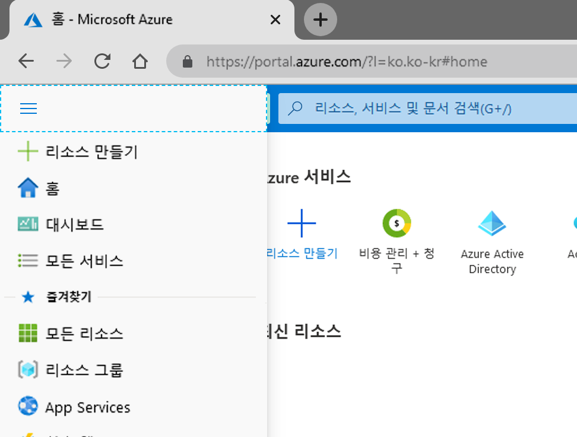
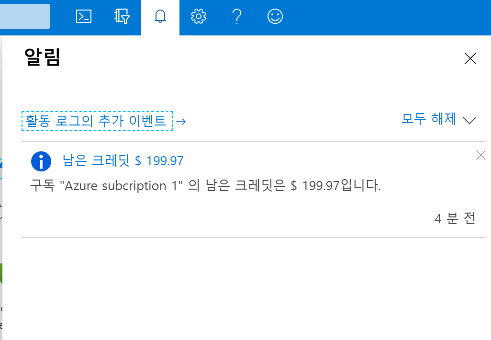

# 미니 랩: Azure Portal 사용

Azure Portal에는 여러 기능과 서비스가 있는데 자주 사용하는 몇 가지 기능에 대해 살펴보겠습니다. 먼저 잠시 시간을 내어 상위 메뉴 모음의 각 아이콘 위에 몇 초간 마우스 포인터를 가리킵니다. 각 아이콘에 대해 도구 설명 레이블 팝업을 사용할 수 있어야 합니다. 이 레이블은 메뉴 항목의 이름입니다. 나중에 이러한 아이콘을 사용합니다.

좁은 화면에는 메뉴가 나타나지 않을 수 있으며 줄임표(...) 단추를 선택합니다.

## 모든 서비스
Azure Portal에서 찾을 수 있는 서비스가 여럿 있습니다.

1. Azure 계정으로 [Azure Portal](https://portal.azure.com)에 로그인합니다.

1. Azure Portal의 왼쪽 상단에서 **포털 메뉴 표시**를 선택합니다.

     

1. **모든 서비스**를 선택합니다. 
    * 잠시 시간을 내어 Azure에서 제공하는 여러 서비스 목록을 검토합니다.

1. **가상 머신**을 선택합니다. (또는 해당 뷰 왼쪽 상단 모서리의 검색 상자를 사용하세요).

1. **가상 머신** 창이 나타납니다. 미리 가상 머신을 만들지 않으면 결과가 없습니다.

1. **+ 추가**를 선택합니다. **가상 머신 만들기** 창이 나타납니다.

1. 오른쪽 상단 모서리에서 **X**를 선택하여 **가상 머신 만들기** 창을 닫습니다.

1. 오른쪽 상단 모서리에서 **X**를 선택하여 **가상 머신** 창을 닫습니다.

1. 왼쪽 상단의 **Microsoft Azure**를 선택하여 홈 페이지로 돌아갑니다.

## Azure Cloud Shell

Azure Cloud Shell을 사용하면 CLI(명령줄 인터페이스)를 통해 Azure 구독에서 명령을 실행할 수 있습니다. 도구 모음에서 아이콘을 선택하여 액세스할 수 있습니다. https://shell.azure.com로 이동하여 포털과는 별개로 브라우저에서 Cloud Shell을 시작할 수도 있습니다.

만들어진 환경에는 다양한 관리 및 프로그래밍 도구가 포함되어 있습니다.

- Azure 명령줄 도구(Azure CLI, AzCopy 등)
- .NET 코어, Python 및 Java를 포함한 언어/프레임워크
- Docker, Kubernetes 등에 대한 컨테이너 관리 지원.
- Vim, Emacs, Code 및 Nano와 같은 코드 편집기
- 빌드 도구(Make, Maven, npm 등)
- sqlcmd와 같은 데이터베이스 쿼리 도구

CLI로 작업.

1. Azure Cloud Shell 아이콘 클릭

1. 개인 환경 설정에 따라 **Bash** 또는 **PowerShell** 환경을 선택할 수 있습니다. 아무거나 선택 
    * 셸 왼쪽에 있는 언어 드롭다운을 통해 언제든지 셸을 변경할 수도 있습니다.
1. 이제 Azure CLI에 액세스했습니다.
1. 쓰기
    > az 버전
1. CLI는 JSON 형식으로 Cloud Shell CLI 버전에 대한 기본 정보를 반환합니다.
1. 이제 오른쪽 상단에 있는 **X**를 클릭하여 닫을 수 있습니다.

## 디렉터리 및 구독

1. **디렉터리 + 구독**(예약 및 필터) 아이콘을 선택하여 **디렉터리 + 구독** 창을 표시합니다.

  여기에서 여러 구독 또는 디렉터리 간에 전환할 수 있습니다. 동일한 전자 메일 주소에 연결된 다른 Azure 디렉터리 있는 경우 해당 구독도 사용할 수 있습니다.

  디렉터리 및 구독에 대해 자세히 알아볼 수 있는 링크도 있습니다.

2. 오른쪽 상단 모서리에서 **X**를 선택하여 **디렉터리 + 구독** 창을 닫습니다.

## 알림 창

1. 아이콘 표시줄 메뉴 모음에서 **알림**(벨) 아이콘을 선택합니다. 이 창에는 보류 중인 알림이 나열됩니다.

    

1. 알림이 표시되면 그 중 하나를 마우스로 가리킵니다. 해당 알림에 표시되는 **X**를 선택하여 해제합니다.

1. **모두 해제**를 선택합니다. 알림이 표시되지 않아야 합니다.

1. 오른쪽 상단 모서리에서 **X**를 선택하여 **알림** 창을 닫습니다.

## 설정

1. **설정** (cog) 아이콘을 선택하여 **Portal 설정** 창을 열고 기본적으로 **일반** 설정을 표시합니다.

1. **비활성 시 로그아웃** 설정을 드롭다운합니다. 예를 들어, 자동 로그아웃하려면 비활성 상태 **1시간 뒤**를 선택과 같은 편리한 옵션을 선택할 수 있습니다.

1. **테마 선택**에서 다른 색깔의 테마를 선택하고 포털 UI의 변경 내용을 관찰합니다. 가장 좋아하는 색상을 설정합니다.

1. **높은 대비 테마**에서 세 가지 옵션을 시도하세요.

1. **팝업 알림 사용 설정** 선택. 이 옵션을 선택하면 알림이 팝업 "알림" 스타일 알림으로 표시됩니다. 여전히 알림 (벨) 아이콘에도 표시됩니다.

1. 설정에서 **언어 및 지역** 탭을 선택합니다. **언어**를 선택하고 **에스파뇰**을 선택한 다음 **적용** 단추를 선택합니다. **이 페이지 번역** 대화 상자가 나타나면 상자를 닫습니다. 전체 Portal은 이제 스페인어로 표시됩니다.

1. 영어로 되돌리려면 상단 메뉴 모음의 **설정** (cog) 아이콘을 선택하고 **Idioma y región**설정으로 전환합니다. **Idioma**를 선택하고 **영어**를 선택합니다. **Aplicar** 단추를 선택합니다. Portal이 영어로 돌아갑니다.

## 도움말 창

1. **도움말** (?) 아이콘을 선택하여 **도움말** 창을 표시합니다.

1. **도움말 + 지원** 단추를 선택합니다.

>:heavy_check_mark: **참고:** 지원 요청은 활성 유료 구독만 사용하여 만들 수 있으므로 이러한 단계 중 일부는 현재 UI와 다를 수 있습니다.

1. **도움말 + 지원** 창에서 **지원**에서 **새 지원 요청**을 선택합니다. 새 지원 요청을 만들려면 다음 각 섹션에 정보를 입력합니다.

    - **기본**사항 : 문제 유형

    - **문제**: 문제의 심각도, 요약 및 설명, 추가 정보

    - **연락 정보**: 기본 연락 방법 및 이 연락 방법과 관련된 정보

1. 문제를 제기하려면 **만들기**를 선택합니다.

1. **모든 지원 요청**을 선택하여 지원 요청의 상태를 볼 수 있습니다.

### 새 소식 및 기타 정보

1. 다시 오른쪽 상단에서 **도움말** 아이콘을 선택하고 **새 소식**을 선택합니다.

1. 최근에 릴리스된 기능을 검토합니다. 또한 다음과 같은 다른 **도움말** 메뉴 옵션을 참고하고 탐색합니다.
    - Azure 로드맵
    - 가이드 투어 시작
    - 바로 가기 키
    - 진단 표시
    - 개인정보처리방침

1. 오른쪽 상단 모서리에서 **X**를 선택하여 **새 소식** 창을 닫습니다. 이제 대시보드로 돌아갑니다.

## 피드백 창

Azure 여정의 어느 시점에서든 몇 가지 피드백이 있거나 당사에 제안을 하려는 경우 다음을 수행할 수 있습니다.

1. **피드백**(웃는 얼굴) 아이콘을 선택하여 **피드백 보내기** 창을 엽니다.

1. **귀하의 경험에 대해 알려주세요**에 Azure에 대한 인상 입력 

1. **Microsoft에서 귀하의 피드백에 대한 이메일을 보낼 수 있습니다**고 쓰여있는 상자를 선택합니다.

1. **피드백 제출**을 선택합니다.

1. **피드백을 보냈습니다** 메시지가 표시되면 닫습니다. 이제 대시보드로 돌아옵니다.

## 프로필 설정

1. 포털의 오른쪽 상단 모서리에서 이름을 선택하여 프로필 정보를 표시합니다.
    - 사용자 이름
    - 사용자 이메일
    - "내 Microsoft 계정" 링크
    - "디렉터리 전환" 링크
    - 다른 계정으로 로그인 또는 완전히 로그아웃
    - 줄임표 단추. 더 많은 옵션을 보려면 클릭
    
        

1. "..."를 선택한 다음 **내 청구서 보기**를 선택하고 Azure가 비용을 생성하는 위치를 분석하는 데 도움이 되는 **Cost Management + 청구 - 송장** 페이지로 이동합니다.

1. 왼쪽 메뉴에서 **Cost Management**로 이동

1. 이번에는 동일한 왼쪽 메뉴에서 Cost Management 아래 **비용 분석**을 선택합니다.

1. 표시된 그래프 바로 위의 **뷰** 클릭 

    

1. 드롭다운 메뉴에서 **서비스별 비용** 선택

>:heavy_check_mark: **참고:** 각 서비스에 대한 비용 세부 정보를 제공합니다. 계정이 새 계정이거나 무료 서비스만 사용하는 경우. 이 페이지는 비어있을 수 있습니다.

1. 오른쪽 상단 모서리에서 **X**를 선택하여 **서비스별 비용** 창을 닫습니다.

1. 오른쪽 상단 모서리에서 **X**를 선택하여 **Cost Management + 청구 - 송장** 페이지를 닫고 홈 페이지로 돌아갑니다.
