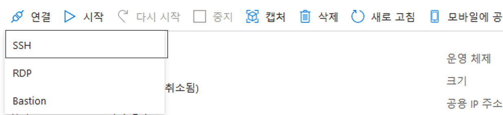
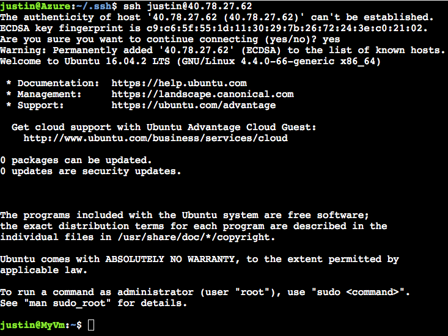

# 미니 랩: Azure Cloud Shell 내 Bash의 빠른 시작

이 문서에서는 Azure Portal에서 Azure Cloud Shell의 Bash를 사용하는 방법에 대해 자세히 설명합니다.

## Cloud Shell 시작

1. Azure 계정으로 [Azure Portal](https://portal.azure.com)에 로그인합니다.

1. Azure Portal의 상단 탐색 메뉴에서 **Cloud Shell** 을 시작합니다.


1. 구독을 선택하여 스토리지 계정 및 Microsoft Azure Files 공유를 만듭니다.

1. **스토리지 만들기**를 선택합니다.

>:pencil: **팁:** 모든 세션에서 Azure CLI에 자동으로 인증됩니다.

## Bash 환경 선택

셸 창 왼쪽의 환경 드롭다운에 **Bash** 가 표시되는지 확인합니다.


## 구독 설정

1. 액세스 가능한 구독 목록.

    ```
    az account list
    ```

1. 기본 설정 구독 설정:

    ```
    az account set --subscription 'my-subscription-name'
    ```
>:pencil: **팁:** 구독은 향후 세션을 위해 `/home/<user>/.azure/azureProfile.json` 을 통해 기억됩니다.

## 리소스 그룹 만들기

미국 서부에 "MyRG"라는 새 리소스 그룹을 만듭니다.

```
az group create --location westus --name MyRG
```

## Linux VM 만들기

새 리소스 그룹에서 Ubuntu VM을 만듭니다. Azure CLI는 SSH 키를 만들고 해당 키를 사용하여 VM을 설정합니다.

```
az vm create -n myVM -g MyRG --image UbuntuLTS --generate-ssh-keys
```

>:heavy_check_mark: **참고:** `--generate-ssh-keys` 를 사용하면 VM 및 `$Home` 디렉터리에서 공용 및 프라이빗 키를 만들고 설정하도록 Azure CLI에 지시합니다. 기본적으로 키는 `/home/<user>/.ssh/id_rsa` 와 `/home/<user>/.ssh/id_rsa.pub` 의 Cloud Shell에 배치됩니다. `.ssh` 폴더는 `$Home` 을 유지하는 데 사용되는 연결된 파일 공유의 5GB 이미지에서 유지됩니다.

이 VM의 사용자 이름은 Cloud Shell($User@Azure:)에서 사용되는 사용자 이름입니다.

## Linux VM에 대한 SSH

1. Azure Portal 검색 창에서 VM 이름을 검색합니다.

1. **연결**을 클릭하여 VM 이름과 공용 IP 주소를 가져옵니다.

    

1. ssh cmd를 사용하여 VM에 SSH.

    ```
    ssh username@ipaddress
    ```

SSH 연결을 설정할 때 Ubuntu 시작 프롬프트가 표시되어야 합니다.



## 정리 중

1. SSH 세션을 끝냅니다.

    ```
    exit
    ```

1. 리소스 그룹 및 해당 그룹 내의 모든 리소스를 삭제합니다.

    ```
    az group delete -n MyRG
    ```
