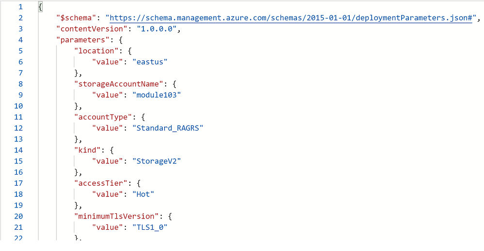
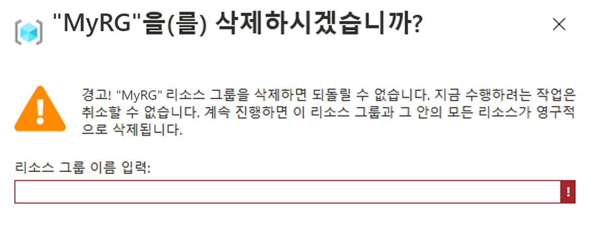

# 미니 랩: Azure Portal을 사용하여 ARM 템플릿 만들기

이 미니 랩에서는 Azure Portal을 사용하여 Azure Resource Manager 템플릿을 만들고 편집하고 배포하는 방법을 알아봅니다. 이 미니 랩에서는 Azure Storage 계정을 만드는 방법을 보여주지만 동일한 프로세스를 사용하여 다른 Azure 리소스를 만들 수 있습니다.

## 포털을 사용하여 템플릿 생성

Azure Portal을 사용하면 Azure Storage 계정 등의 리소스를 구성할 수 있습니다. 리소스를 배포하기 전에 Resource Manager 템플릿으로 구성을 내보낼 수 있습니다. 이 템플릿은 저장해 두었다가 나중에 재사용할 수 있습니다.

1. Azure portal(https://portal.azure.com/)에 로그인합니다.

1. **리소스 만들기** 선택

1. **Marketplace 검색**에서 ***스토리지 계정***을 입력하고 표시되는 옵션을 선택합니다.

1. *스토리지 계정* 뷰에서 **만들기**를 클릭합니다.

1. 다음 정보를 입력합니다.

    * **리소스 그룹:** **새로 만들기**를 선택한 후 리소스 그룹 이름을 원하는 대로 지정합니다. 
    * **스토리지 계정 이름:** 스토리지 계정에 고유한 이름을 지정합니다. 스토리지 계정 이름은 Azure 전체에서 고유해야 합니다. "이 스토리지 계정 이름은 이미 사용되었습니다"라는 오류 메시지가 표시될 경우 **\<your name\>storage\<Today's date in MMDD\>**(예: *jackstorage1016*)를 사용합니다.
    
    * 나머지 속성에 대해서는 기본값을 사용할 수 있습니다.
    > **참고:** 일부 내보낸 템플릿은 배포하기 전에 약간의 편집이 필요합니다.

1. 화면 왼쪽 하단의 **검토 + 만들기**를 클릭합니다.

    ❗️ **참고:**  다음 단계에서 **만들기**를 선택하지 ***마십시오***.

1. 화면 오른쪽 하단의 **자동화에 대한 템플릿 다운로드**를 선택합니다. 생성된 템플릿이 포털에 표시됩니다.

    * 주 창에 템플릿이 표시됩니다. 6개의 최상위 요소가 있는 JSON 파일입니다. `schema`, `contentVersion`, `parameters`, `variables`, `resources`, `output`.

    * **매개 변수** 6개가 정의되어 있습니다. 그 중 하나가 **storageAccountName**입니다. 
        > 다음 섹션에서는 스토리지 계정에 생성된 이름을 사용하도록 템플릿을 편집합니다.

    * 템플릿에는 Azure **리소스** 하나가 정의되어 있습니다. 유형은 `Microsoft.Storage/storageAccounts` 입니다. 리소스가 정의되는 방법과 정의 구조를 확인합니다.
    
1. 화면 상단("템플릿" 아래)의 **다운로드**를 선택합니다. 

1. 다운로드한 zip 파일을 열면 2개의 파일(**parameters.JSON** 및 **template.JSON**)이 있습니다. 컴퓨터에 두 파일을 모두 저장합니다. 
    > 다음 섹션에서는 템플릿 배포 도구를 사용하여 템플릿을 편집합니다.

1. **매개 변수** 탭을 선택하여 입력한 값을 확인합니다. 이러한 값을 적어 둡니다. 이러한 값은 다음 섹션에서 템플릿을 배포할 때 필요합니다.
    * 예제:

        

1. 창 왼쪽 상단에 있는 **Microsoft Azure** 레이블을 눌러 홈 뷰로 돌아가기
 
## 템플릿 편집 및 배포

Azure Portal에서 *템플릿 배포*라는 포털 도구를 사용하여 몇 가지 기본 템플릿 편집을 수행할 수 있습니다. 더 복잡한 템플릿을 편집하려는 경우에는 더욱 많은 편집 기능을 제공하는 Visual Studio Code를 사용하는 것이 좋습니다.

> **팁:** Azure에서는 각 Azure 서비스의 이름이 고유해야 합니다. 이미 존재하는 저장소 계정 이름을 입력하면 배포가 실패합니다. 템플릿 함수 `uniquestring()` 을 사용하여 고유한 스토리지 계정 이름을 생성하면 이 문제를 방지할 수 있습니다.

1. Azure Portal에서 **리소스 만들기**를 선택합니다.

1. **Marketplace 검색**에 **템플릿 배포**를 입력하고 표시되는 옵션을 선택합니다.
(**템플릿 배포(사용자 지정 템플릿을 사용하여 배포)**).

1. **만들기**를 선택합니다.

1. **편집기에서 사용자 고유의 템플릿 빌드**를 선택하여 편집기를 엽니다.

1. *템플릿 편집* 아래의 메뉴에서 **로드 파일**를 선택한 다음, 마지막 섹션에서 다운로드한 *template.json* 파일을 선택합니다.

1. 템플릿에서 다음 세 가지를 변경합니다.

    * `parameters` 요소에서 **storageAccountName** 매개 변수를 제거합니다. 
    * 아래에 나와 있는 것처럼 `variables` 요소에 **storageAccountName**라는 변수를 추가합니다. 아래 예제는 고유한 스토리지 계정 이름을 생성합니다.
        ```JSON
        "storageAccountName": "[concat(uniqueString(subscription().subscriptionId), 'storage')]"
        ```
    * **Microsoft.Storage/storageAccounts**가 위치한 `리소스` 의 이름 요소를 업데이트하여 매개 변수 대신 새로 정의한 변수를 사용합니다.
       ```json
       "name": "[variables('storageAccountName')]",
       ```   

1. **저장**을 선택합니다.

1. 양식이 나타납니다.

1. 나타나는 양식의 **기본** 섹션에서, 마지막 섹션에서 만든 리소스 그룹을 선택합니다.

1. 양식의 **설정** 섹션에서 이전 섹션의 8단계에서 작성한 매개 변수의 값을 입력합니다. 다음은 샘플 배포의 스크린샷입니다.

    

1. 사용 약관과 조건에 동의하고 **구매**를 선택합니다.

1. 화면 상단의 종 모양 아이콘(알림)을 선택하여 배포 상태를 표시합니다.
    > 배포가 완료될 때까지 기다립니다.

1. 배포가 완료되면 알림 창에서 **리소스 그룹으로 이동**을 선택합니다. 배포 상태가 성공적이라고 표시되어야 합니다. 리소스 그룹에는 스토리지 계정이 하나밖에 없습니다. 스토리지 계정 이름은 템플릿에서 생성한 고유 문자열입니다. 

## 리소스 정리

Azure 리소스가 더 이상 필요하지 않으면 리소스 그룹을 삭제하여 배포한 리소스를 정리합니다.

1. 상단의 옵션에서 **리소스 그룹 삭제** 클릭

    

1. 작업을 확인하기 위해 **리소스 그룹 이름을 입력**하라는 메시지가 표시됩니다.

    

1. 이제 창 하단에서 **삭제** 버튼을 클릭할 수 있습니다.

1. 리소스가 삭제되었음을 나타내는 알림 창 대기

1. 완료했습니다!
