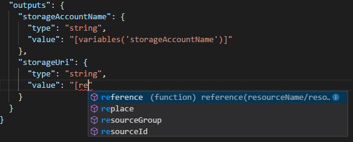
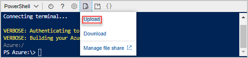
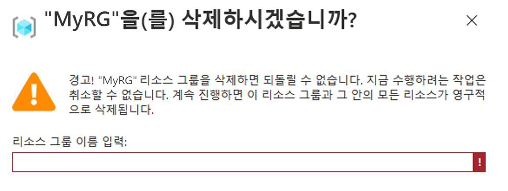

# 미니 랩: Visual Studio Code를 사용하여 ARM 템플릿 만들기

**Azure Resource Manager(ARM)** 는 Azure 계정에서 리소스를 생성, 업데이트 및 삭제할 수 있는 관리 계층을 제공하는 서비스입니다.

이 미니 랩에서는 Visual Studio Code 및 Azure Resource Manager (ARM) 도구 확장을 사용하여 Azure Resource Manager 템플릿을 만들고 편집하는 방법을 알아봅니다. 확장 없이 Visual Studio Code에서 Resource Manager 템플릿을 만들 수 있지만 확장은 템플릿 개발을 단순화하는 자동 완성 옵션을 제공합니다.

[Azure 빠른 시작 템플릿](https://azure.microsoft.com/resources/templates/) 사이트에서 사용할 수 있는 기존의 빠른 시작 템플릿 중 하나를 기반으로 ARM 템플릿을 빌드하는 것이 더 쉽고 더 나은 경우가 많습니다.

이 미니 랩은 [Standard Storage 계정 만들기](https://azure.microsoft.com/resources/templates/101-storage-account-create/) 템플릿을 기반으로 합니다.

## 필수 요구 사항

필요한 사항은 다음과 같습니다.

* Visual Studio Code. 여기에 사본을 다운로드할 수 있습니다. [https://code.visualstudio.com/](https://code.visualstudio.com/).
* Resource Manager Tools 확장.

다음 단계에 따라 Resource Manager Tools 확장을 설치합니다.

1. Visual Studio Code를 엽니다.
1. **CTRL+SHIFT+X**를 눌러확장 창을 엽니다.
1. **Azure Resource Manager Tools** 를 검색한다음 **설치**를 선택합니다.
1. 확장 설치를 완료하려면 **다시 로드**를 선택합니다.

## 빠른 시작 템플릿 엽니다.

1. 다음 주소로 이동하여 파일의 콘텐츠를 복사합니다.

    ```
    https://raw.githubusercontent.com/Azure/azure-quickstart-templates/master/101-storage-account-create/azuredeploy.json
    ```


1. Visual Studio Code에서 **파일 > 새 파일**을 선택합니다.

1. 이전에 복사된 코드를 파일에 붙여넣기

1. 파일을 저장하려면 **파일 > 다른 이름으로 저장...** 을 선택합니다. 

1. 파일을 로컬 컴퓨터에 *azuredeploy.json* 으로 저장합니다.


## 템플릿 편집

저장소 URI를 표시하려면 출력 섹션에 요소를 하나 더 추가합니다.

1. `azuredeploy.json` 의 **출력** 속성에 다음 코드를 추가합니다.

    ```json
    "storageUri": {
        "type": "string",
        "value": "[reference(variables('storageAccountName')).primaryEndpoints.blob]"
    },
    ```

    작업이 완료되면 출력 섹션이 다음과 같이 표시됩니다.

    ```json
    "outputs": {
        "storageAccountName": {
            "type": "string",
            "value": "[variables('storageAccountName')]"
        },
        "storageUri": {
            "type": "string",
            "value": "[reference(variables('storageAccountName')).primaryEndpoints.blob]"
        }
    }
    ```
    > **팁:** `storageAccountName` 과 방금 추가한 `storageUri` 사이에는 콜론(`,`)이 있으니 주의하세요.

    Visual Studio Code 내에서 코드를 복사하여 붙여 넣은 경우 **값** 요소를 다시 입력하여 Resource Manager Tools 확장의 IntelliSense 기능을 경험해 보십시오.

    

1. 파일을 저장하려면 **파일 > 저장**을 선택합니다.


## 템플릿 배포

템플릿을 배포하는 방법에는 여러 가지가 있으며 여기서는 Azure Cloud Shell을 사용합니다. 

1. [Azure Cloud Shell](https://shell.azure.com/)에 로그인.

     * **"스토리지가 마운트되어 있지 않습니다"** 라는 메시지가 표시되면 기본 선택을 유지하고 **스토리지 만들기**를 클릭합니다(스토리지 만들기에는 몇 초 정도 걸릴 수 있습니다).

1. 터미널에서 작업이 완료되어 다음을 표시할 때까지 기다리세요.
    `*YourName*@Azure:~$`

1. 왼쪽 위 모서리에 있는 **PowerShell** 환경을 선택합니다. 

1. 전환할 때 셸을 다시 시작해야 합니다. **확인** 단추를 클릭합니다.

1. 터미널에서 작업이 완료되어 다음을 표시할 때까지 기다리세요.
    `PS /home/*YourName*>`

1. **파일 업로드/다운로드** 아이콘을 선택한 다음 **업로드**를 선택합니다.

    

1. 이전 섹션에서 저장한 파일(**azuredeploy.json**)을 선택합니다. 

1. 창 오른쪽 하단에 확인이 표시됩니다.
    * 파일이 성공적으로 업로드되었는지 확인하려면 다음 명령을 실행합니다.
    
        `ls`
    * 콘솔이 (여러 파일 사이에) **azuredeploy.json**을 반환하면 업로드가 성공한 것입니다.

    
1. Cloud Shell에서 다음 명령을 실행합니다. 

    ```powershell
    $resourceGroupName = Read-Host -Prompt "Enter the Resource Group name"
    ```
    * 이 명령은 리소스 그룹에 대한 이름을 입력하도록 요청합니다(예: "MyRS").

    ```powershell
    $location = Read-Host -Prompt "위치를 입력합니다(예: centralus)"
    ```
    * 이 명령은 리소스 그룹의 위치(예: westus, eastus 또는 centralus)를 입력하라고 요청합니다.

    ```powershell
    New-AzResourceGroup -Name $resourceGroupName -Location "$location"
    ```
    * 이 명령은 방금 입력한 구성을 표시합니다.

    ```powershell
    New-AzResourceGroupDeployment -ResourceGroupName $resourceGroupName -TemplateFile "$HOME/azuredeploy.json"
    ```
    * 이 명령은 이전에 제공한 값에 따라 새 Azure `ResourceGroupDeployment`를 만듭니다(이 명령에는 몇 초 정도 소요됩니다).

        > **azuredeploy.json**이 아닌 다른 이름으로 파일을 저장하는 경우 템플릿 파일 이름을 업데이트합니다.

    * 다음 스크린샷은 샘플 배포를 보여 줍니다

        

    * 출력 섹션의 스토리지 계정 이름과 스토리지 URL이 스크린샷에 강조 표시됩니다. 

## 리소스 정리

Azure 리소스가 더 이상 필요하지 않으면 리소스 그룹을 삭제하여 배포한 리소스를 정리합니다.
1. Azure 계정으로 이동합니다.
1. 상단의 검색 표시줄에서 **리소스 그룹**을 작성하고 `서비스` 에서 "리소스 그룹"이라는 이름을 선택합니다.
1. 방금 만든 리소스 그룹의 이름을 찾습니다.
1. 해당 이름을 클릭합니다.
1. 상단의 옵션에서 **리소스 그룹 삭제** 클릭

    

1. **리소스 그룹 이름을 입력**하여 작업을 확인하라는 메시지가 표시됩니다(창 왼쪽 상단에 있는 `홈` 아래 이름).

    

1. 이제 창 하단에서 **삭제** 단추를 클릭할 수 있습니다.

1. 리소스가 삭제되었다는 알림 패널이 표시될 때까지 기다립니다.

1. 완료했습니다!

