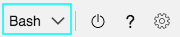
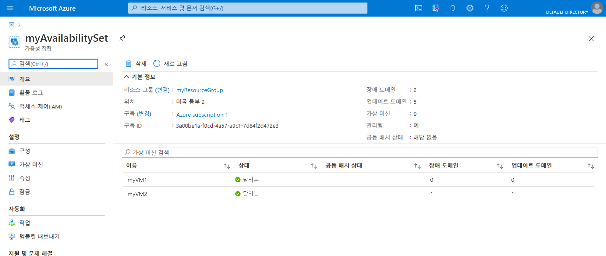

# 미니 랩: 가용성 집합 내에서 VM 만들기

## 전제 조건

이 미니 랩 전에 다음과 같은 필수 구성 요소를 준비되어 있어야 합니다.

- 환경 변수를 미리 설정합니다. **AdminPassword="myStr0ngPW%%"**

## 가용성 집합 만들기

1. Azure Portal의 위쪽 탐색 메뉴에서 Cloud Shell을 시작합니다.

    

1. 셸 창 왼쪽의 환경 드롭다운에 **Bash** 가 표시되는지 확인합니다.

    

1. 다음 명령을 실행하여 리소스 그룹을 만듭니다. `az group create --name myResourceGroup --location westus`

1. 다음 명령을 실행하여 관리 가용성 집합을 만듭니다. `az vm availability-set create --resource-group myResourceGroup --name myAvailabilitySet --platform-fault-domain-count 2 --platform-update-domain-count 2`

## 가용성 집합 내에서 VM 만들기

VM은 하드웨어 전체에 올바르게 배포되었는지 확인하기 위해 가용성 집합 내에서 만들어야 합니다. 기존 VM을 만든 후 가용성 집합에 추가할 수 없습니다.
az vm create로 VM을 만들 때 --availability-set 매개 변수를 사용하여 가용성 집합의 이름을 지정합니다.

1. 다음 명령을 실행하여 2개의 가상 머신을 만듭니다.

    ```
    for i in `seq 1 2`; do
    az vm create \
        --resource-group myResourceGroup \
        --name myVM$i \
        --availability-set myAvailabilitySet \
        --vnet-name MyVnet --subnet subnet1 \
        --image debian \
        --admin-password $AdminPassword \
        --admin-username azureuser \
        --no-wait
    done
    ```

1. 2개의 VM을 만들고 구성하는 데는 몇 분 정도 걸립니다. 완료되면 기본 하드웨어에 2개의 가상 머신이 배포됩니다.

1. Azure Portal에서 **리소스 그룹** > **myResourceGroupAvailability** > **myAvailabilitySet** 로 이동하여 가용성 집합을 살펴봅니다. VM이 2개의 장애 및 업데이트 도메인에 배포되는 방법을 확인해야 합니다.

    

## 배포 정리

1. 다음 명령을 실행하여 리소스 그룹, VM 및 모든 관련 리소스를 제거합니다. `az group delete --name myResourceGroup --yes`
