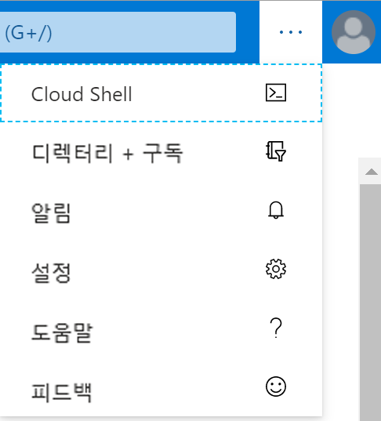

# 미니 랩: 가용성 집합 내에서 VM 만들기

## 사전 요구 사항

이 미니 랩에 들어가기 전에 환경 변수 `AdminPassword` 를 미리 설정해야 합니다. 이를 위해 다음을 수행하세요.

1. Azure Portal의 위쪽 탐색 메뉴에서 Cloud Shell을 시작합니다.

    

    * 아이콘이 좁은 화면의 상단 메뉴 모음에 표시되지 않으면 줄임표(...) 단추를 선택합니다.

        

    * **"스토리지가 마운트되어 있지 않습니다"** 라는 메시지가 표시되면 기본 선택을 유지하고 **스토리지 만들기**를 클릭합니다(스토리지 만들기에는 몇 초 정도 걸릴 수 있습니다).

1. Cloud Shell이 열리면, 셸 창 왼쪽의 환경 드롭다운에 **Bash**가 표시되는지 확인합니다.

    

    * "Bash"가 표시되지 않으면 `Bash` 를 클릭하여 선택합니다. 확인

1. bash가 준비되면 자신의 암호를 사용하여 다음 명령을 입력하세요

    `
    AdminPassword="myStr0ngPW%%"
    `

    > *myStr0ngPW%*를 자신이 선호하는 비밀 값으로 변경하되, 암호 길이는 12~72자이어야 하며, 소문자 1개, 대문자 1개, 숫자 1개, 특수 문자 1개를 각각 포함해야 합니다. 
    
1. 환경 변수가 설정되었는지 다음 명령으로 확인합니다.

    `
    echo $AdminPassword
    `


## 가용성 집합 만들기

1. 다음 명령을 실행하여 리소스 그룹을 만듭니다. 

    `az group create --name myResourceGroup --location eastus`

1. 다음 명령을 실행하여 관리 가용성 집합을 만듭니다. 

    `az vm availability-set create --resource-group myResourceGroup --name myAvailabilitySet --platform-fault-domain-count 2 --platform-update-domain-count 2`
    * 완료되기까지 잠시 시간이 소요됩니다

## 가용성 집합 내에서 VM 만들기

VM은 하드웨어 전체에 올바르게 배포되었는지 확인하기 위해 가용성 집합 내에서 만들어야 합니다. 기존 VM을 만든 후 가용성 집합에 추가할 수 없습니다.

> az vm create로 VM을 만들 때 --availability-set 매개 변수를 사용하여 가용성 집합의 이름을 지정합니다.

1. 다음 명령을 실행하여 2개의 가상 머신을 만듭니다.

    ```
    for i in `seq 1 2`; do
    az vm create \
        --resource-group myResourceGroup \
        --name myVM$i \
        --availability-set myAvailabilitySet \
        --vnet-name MyVnet --subnet subnet1 \
        --image debian \
        --admin-password $AdminPassword \
        --admin-username azureuser \
        --대기 안 함
    완료
    ```

1. 2개의 VM을 만들고 구성하는 데는 몇 분 정도 걸립니다. 완료되면 기본 하드웨어에 2개의 가상 머신이 배포됩니다.

1. 창 상단의 검색 창에서 **리소스 그룹**을 입력하고 해당 이름의 서비스를 선택합니다.

1. 리소스 그룹 뷰가 표시되면 **myResourceGroup**을 선택합니다.

1. `myResourceGroup` 에 포함된 리소스에서. **myAvailabilitySet** 선택

1. VM이 2개의 장애 및 업데이트 도메인에 배포되는 방법을 확인해야 합니다.

    

## 배포 정리

1. 다음 명령을 실행하여 리소스 그룹, VM 및 모든 관련 리소스를 제거합니다. `az group delete --name myResourceGroup --yes`

    * 명령이 완료되기까지 잠시 시간이 걸릴 수 있습니다.
