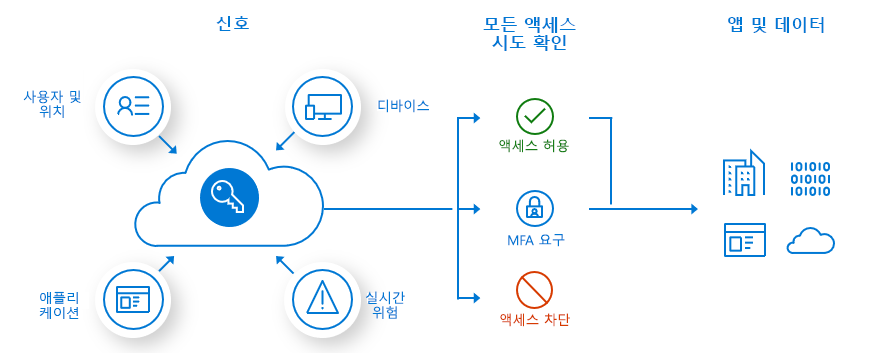
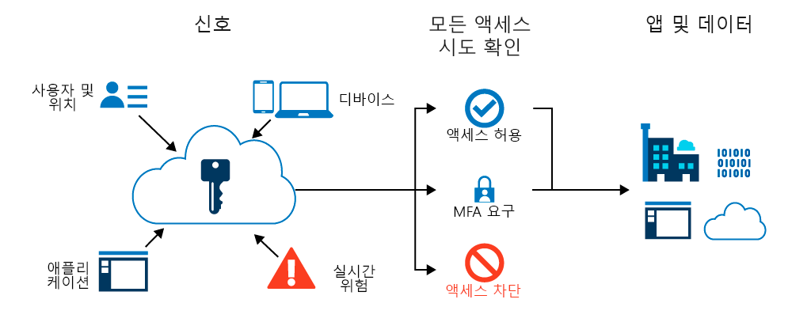
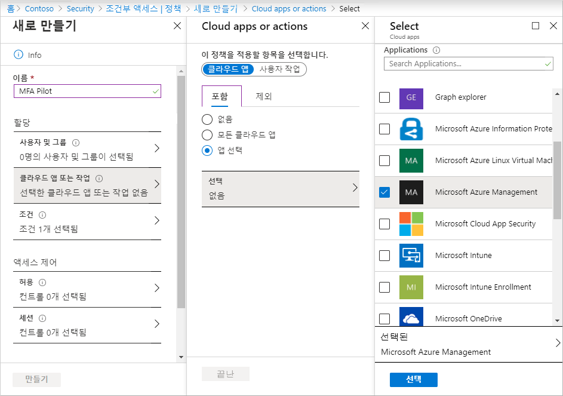
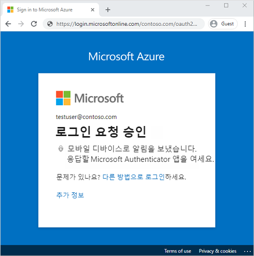

# 미니 랩: Azure Multi-Factor Authentication을 통해 사용자 로그인 이벤트 보안

MFA(다단계 인증)는 추가 형태의 식별을 위해 로그인 이벤트 중에 사용자에게 메시지가 표시되는 프로세스입니다. 휴대폰에 코드를 입력하거나 지문 검사를 제공하라는 메시지가 사용자에게 표시될 수 있습니다. 두 번째 유형의 인증을 요구하면 추가 인수를 공격자가 가져오거나 복제하기가 쉽지 않기 때문에 보안이 강화됩니다.

Azure Multi-Factor Authentication 및 조건부 액세스 정책은 특정 로그인 이벤트 중에 사용자가 MFA를 사용할 수있는 유연성을 제공합니다.

**사전 요구 사항**

이 미니 랩을 수행하려면 다음 리소스와 권한이 필요하므로 이 랩은 **강사용 데모**로 실행하는 것이 적합합니다.

* Azure AD Premium 또는 평가판 라이센스를 사용하는 작동 중인 Azure AD 테넌트. 

* 글로벌 관리자 권한이 있는 계정.

* 알려진 암호(예: testuser)가 있는 비관리자 사용자입니다. 이 미니 랩에서는 이 계정을 사용하여 최종 사용자 Azure 다단계 인증 환경을 테스트합니다. 

* 관리자가 아닌 사용자가 구성원인 그룹(예: MFA-Test-Group). 이 미니 랩에서는 이 그룹에 대한 Azure 다단계 인증을 사용하도록 설정합니다. 

## 조건부 액세스 정책 만들기

Azure Multi-Factor Authentication을 활성화하고 사용하기 위한 권장 방법은 조건부 액세스 정책을 사용하는 것입니다. 조건부 액세스를 사용하면 로그인 이벤트에 반응하는 정책을 만들고 정의하며, 사용자가 애플리케이션 또는 서비스에 대한 액세스 권한을 부여하기 전에 추가 작업을 요청할 수 있습니다.

이 미니 랩에서는 사용자가 Azure Portal에 로그인할 때 MFA에  묻는 기본 조건부 액세스 정책을 만듭니다. 

먼저 조건부 액세스 정책을 만들고 다음과 같이 사용자의 테스트 그룹을 할당합니다.

1. 글로벌 관리자 권한을 사용하여 [Azure Portal](https://portal.azure.com/)에 로그인합니다.

1. **Azure Active Directory**를 검색하여 선택하고 왼쪽 메뉴의 **보안**을 선택합니다.

1. 다시 왼쪽 메뉴에서 **조건부 액세스**를 선택하고 **+ 새 정책**을 선택합니다.

1. 정책의 이름을 입력합니다(예: *MFA Pilot*).

1. **할당**에서 **사용자 및 그룹**을 선택한 다음, **사용자 및 그룹 선택**을 선택합니다.

1. **사용자 및 그룹** 확인란을 선택한 다음, **선택**을 선택합니다.

1. Azure AD 그룹(예: *MFA-Test-Group*)을 찾아서 선택한 다음, **선택**을 선택합니다.

    

1. 그룹에 조건부 액세스 정책을 적용하려면 **완료**를 선택합니다.

## Multi-Factor Authentication을 위한 조건 구성

조건부 액세스 정책이 만들어지고 사용자 테스트 그룹이 할당되면 이제 정책을 트리거하는 클라우드 앱 또는 작업을 정의할 수 있습니다. 이러한 클라우드 앱 또는 작업은 MFA 요청과 같은 추가 처리가 필요한 시나리오입니다. 

사용자가 Azure Portal에 로그인할 때 MFA를 요구하도록 조건부 액세스 정책을 구성합니다.

1. **클라우드 앱 또는 작업**을 선택합니다. *모든 클라우드 앱*에 조건부 액세스 정책을 적용하도록 선택하거나 *앱 선택*을 선택합니다.

1. **포함** 페이지에서 **앱 선택**을 선택합니다.

1. **선택**을 선택한 다음, 사용할 수 있는 로그인 이벤트 목록을 찾습니다.

1. **Microsoft Azure 관리**를 선택하여 정책에서 Azure Portal에 로그인 이벤트를 적용하도록 합니다.

1. 선택한 앱을 적용하려면 **선택**을 선택한 다음, **완료**를 선택합니다.

    

1. 액세스 제어를 사용하면 승인된 클라이언트 앱이 필요하거나 하이브리드 Azure AD에 가입된 디바이스를 사용하는 등 사용자에게 액세스 권한을 부여하기 위한 요구 사항을 정의할 수 있습니다. Azure Portal에 로그인 이벤트 중에 MFA를 요구하도록 액세스 제어를 구성합니다.

1. **액세스 제어**에서 **권한 부여**를 선택한 다음, **액세스 권한 부여**가 선택되어 있는지 확인합니다.

1. **다단계 인증 필요** 확인란을 선택하고 **선택**을 선택합니다.

    조건부 액세스 정책은 구성이 사용자에게 미치는 영향을 확인하려는 경우 보고서 전용, 해당 정책을 바로 사용하지 않으려는 경우 끄기로 설정할 수 있습니다. 사용자 테스트 그룹이 이 데모의 대상이 되었기 때문에 정책을 활성화한 다음 Azure Multi-Factor Authentication을 테스트해 보겠습니다.

1. *정책 사용*을 **켜기**로 설정합니다.

1. *조건부 액세스 정책*을 적용하려면 **만들기**를 선택합니다.

## Azure Multi-Factor Authentication 테스트

조건부 액세스 정책 및 Azure 다단계 인증을 보려면 다음과 같이 MFA가 필요하지 않은 리소스에 로그인합니다.

1. InPrivate 또는 incognito 모드에서 새 브라우저 창을 열고 [https://account.activedirectory.windowsazure.com](https://account.activedirectory.windowsazure.com/)으로 이동합니다.

1. 관리자가 아닌 테스트 사용자(예: testuser)로 로그인합니다. MFA를 완료하라는 메시지가 표시되지 않습니다.

1. 브라우저 창을 닫습니다.

    이제 Azure Portal에 로그인합니다. 추가 확인을 요구하는 조건부 액세스 정책에서 Azure Portal을 구성했기 때문에 Azure 다단계 인증 프롬프트를 받게 됩니다.

1. InPrivate 또는 시크릿 모드에서 새 브라우저 창을 열고 [https://portal.azure.com](https://portal.azure.com/)으로 이동합니다.

1. 관리자가 아닌 테스트 사용자(예: testuser)로 로그인합니다. Azure 다단계 인증을 등록하고 사용해야 합니다. 프롬프트를 따라 프로세스를 완료하고 Azure Portal에 성공적으로 로그인했는지 확인합니다.

    
