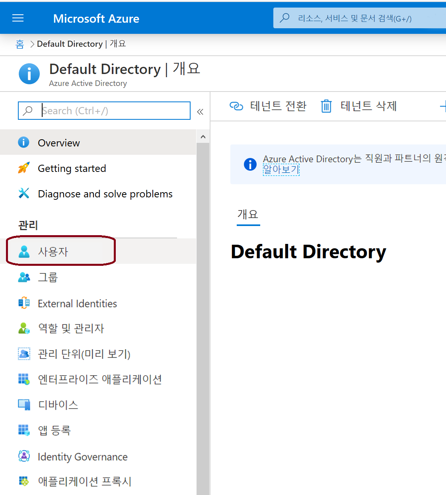
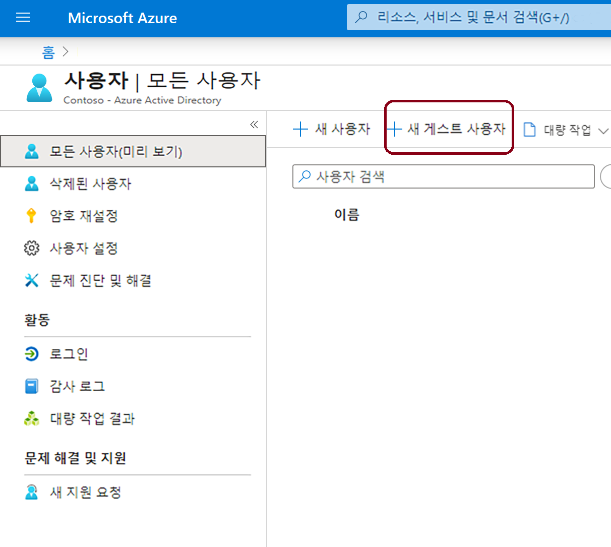
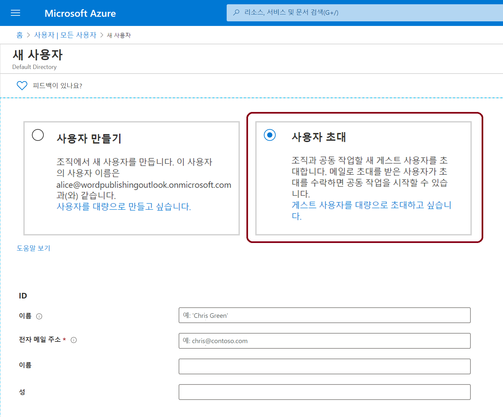
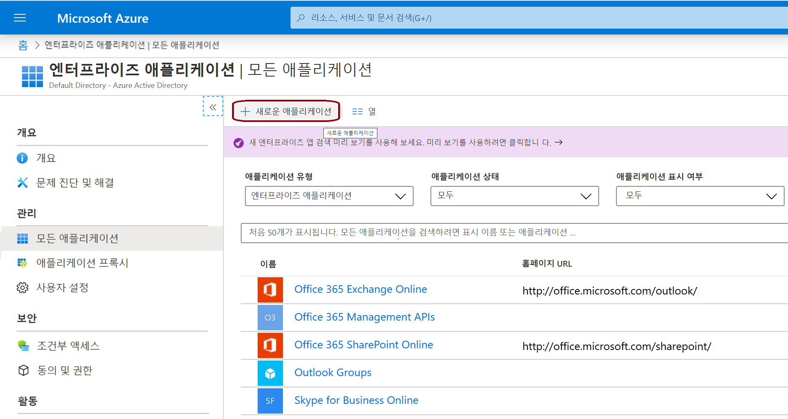
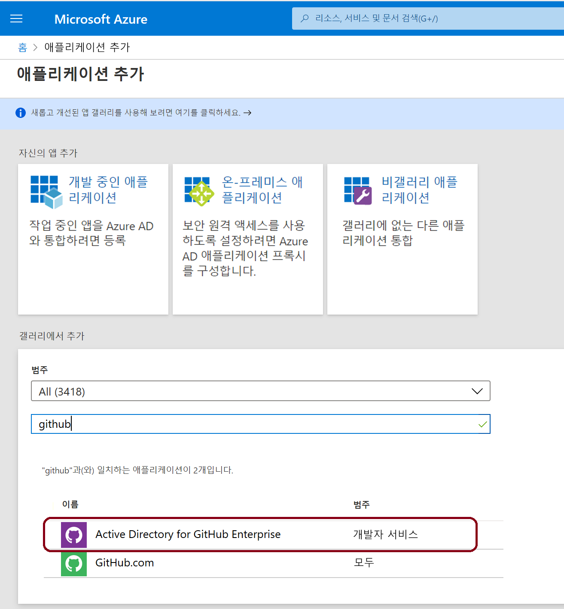
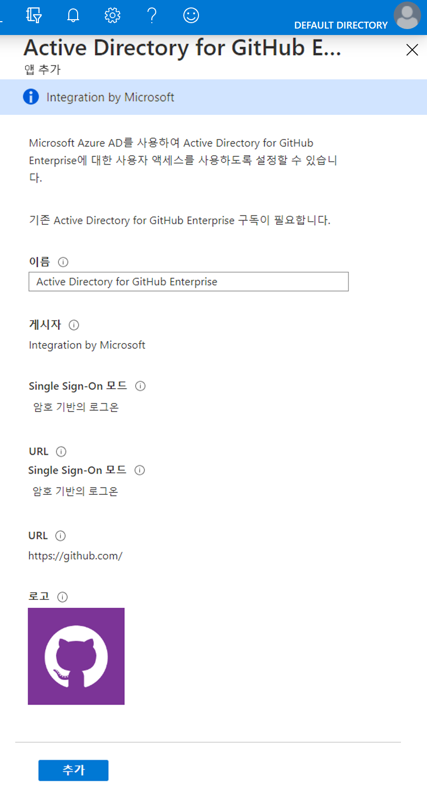
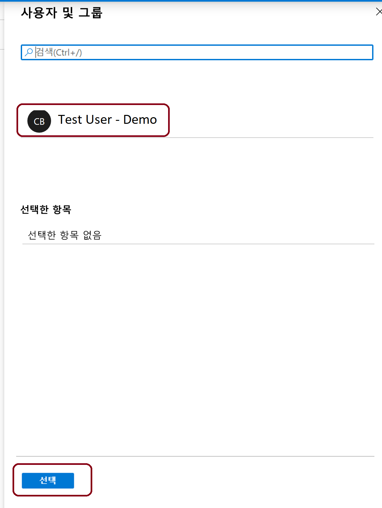
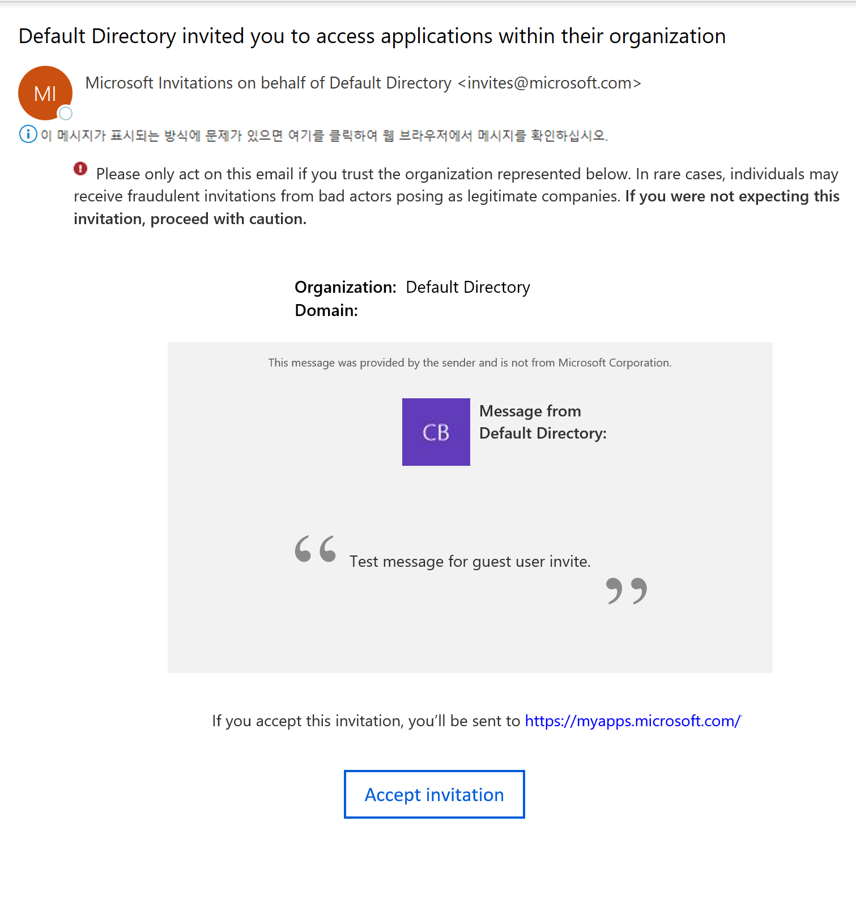

# 미니 랩: Azure Portal에서 Azure AD에 게스트 사용자 추가

디렉터리에 게스트 사용자로 추가하여 모든 사용자를 조직과 공동 작업하도록 초대할 수 있습니다. 그런 다음 이행 링크가 포함된 초대 전자 메일을 보내거나 공유할 앱에 직접 링크를 보낼 수 있습니다. 

게스트 사용자는 자신의 직장이나 학교 또는 소셜 ID로 로그인할 수 있습니다.

이 미니 랩에서는 Azure AD에 새 게스트 사용자를 추가하고 초대장을 보냅니다.

## 전제 조건

이 미니 랩의 시나리오를 완료하려면 다음을 수행해야 합니다.

* 글로벌 관리자 역할 또는 제한된 관리자 디렉터리 역할과 같이 테넌트 디렉터리에서 사용자를 만들 수 있는 역할입니다.

* 테넌트 디렉터리에 추가할 수 있고 테스트 초대 전자 메일을 수신하는 데 사용할 수 있는 유효한 이메일 계정입니다.

## Azure AD에 게스트 사용자 추가

1. Azure AD 관리자로 [Azure Portal](https://portal.azure.com/)에 로그인합니다.

2. 왼쪽 창에서 **Azure Active Directory**를 선택합니다.

3. **관리**에서 **사용자**를 선택합니다.

    

4. **새 게스트 사용자**를 선택합니다.

    

5. **새 사용자** 페이지에서 **사용자 초대**를 선택하고 게스트 사용자의 정보를 추가합니다.

    

    - **이름** 게스트 사용자의 이름과 성입니다.

    - **전자 메일 주소(필수)** 게스트 사용자의 전자 메일 주소입니다.

    - **개인 메시지(선택 사항)** 게스트 사용자에 대한 개인 환영 메시지를 포함합니다.

    - **그룹** 게스트 사용자를 하나 이상의 기존 그룹에 추가할 수 있습니다. 나중에 추가할 수도 있습니다.

    - **디렉터리 역할** 사용자에 대한 Azure AD 관리 권한이 필요한 경우 Azure AD 역할에 추가할 수 있습니다.

6. **초대**를 선택하여 게스트 사용자에게 초대를 자동으로 보냅니다. 오른쪽 상단에 [사용자를 초대했습니다]라는 메시지와 함께 알림이 표시됩니다.

7. 초대를 보내고 나면 해당 사용자 계정이 디렉터리에 게스트로 자동으로 추가됩니다.

## 게스트 사용자에게 앱 할당

*GitHub Enterprise용 Active Directory*를 테스트 테넌트에 추가하고 테스트 게스트 사용자를 앱에 할당합니다.

1. Azure Portal에 Azure AD 관리자로 로그인합니다.

2. 왼쪽 창에서 **엔터프라이즈 애플리케이션**을 선택합니다.

3. **새 애플리케이션**을 선택합니다.

    

4. **갤러리에서 추가**에서 **GitHub**를 검색한 다음 **GitHub Enterprise용 Active Directory**를 선택합니다.

    

5. **추가**를 선택합니다.

6. 관리에서 Single **Sign-On**을 선택하고 **Single Sign-On 모드**에서 **암호 기반 Sign-On**을 선택한 후 **추가**를 클릭합니다.

    

7. **관리**에서 **사용자 및 그룹 > 사용자 추가 > 사용자 및 그룹**을 선택하고 **선택**을 클릭합니다.

    

8. **할당**을 선택합니다.

## 게스트 사용자 초대 수락

이제 게스트 사용자 이메일 계정에 로그인하여 초대를 볼 수 있습니다.

1. 테스트 게스트 사용자의 이메일 계정에 로그인합니다.

2. 받은 편지함에서 "*초대되었습니다*" 전자 메일을 찾습니다.

3. 전자 메일 본문에서 [시작하기]를 선택합니다. 권한 검토 페이지는 브라우저에서 열립니다.

4. **초대 수락**을 선택합니다. 게스트 사용자가 액세스할 수 있는 애플리케이션을 나열하는 액세스 패널이 열립니다.

    
