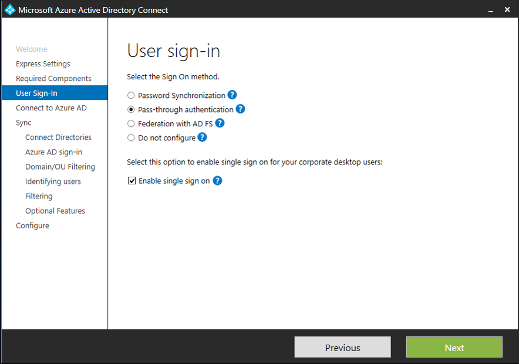
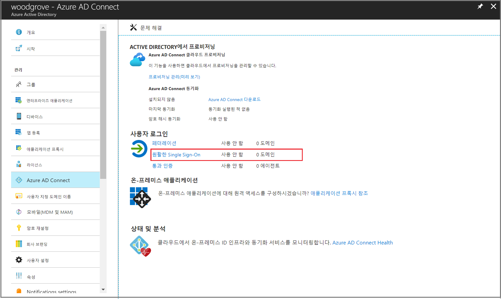

# 미니 랩: Azure Active Directory Seamless Single Sign-On

 

Azure AD(Azure Active Directory) Seamless SSO(Seamless Single Sign-On)은 사용자가 회사 네트워크에 연결된 회사 데스크톱에 있을 때 자동으로 로그인합니다. 원활한 SSO는 추가 온-프레미스 구성 요소 없이도 사용자가 클라우드 기반 애플리케이션에 쉽게 액세스할 수 있도록 합니다.

## 전제 조건

이 미니 랩 전에 다음과 같은 필수 구성 요소를 준비되어 있어야 합니다.

* **Azure AD Connect 서버 설정**: 로그인 방법으로 통과 인증을 사용하는 경우 추가 필수 구성 요소 검사가 필요하지 않습니다. 로그인 방법으로 암호 해시 동기화를 사용하고 Azure AD Connect와 Azure AD 사이에 방화벽이 있는 경우 다음을 확인합니다.

	* 버전 1.1.644.0 이상의 Azure AD Connect를 사용합니다.
	
	* 방화벽 또는 프록시에서 DNS 허용 목록을 허용하는 경우, 포트 443을 통한 *.msappproxy.net URL 연결을 허용 목록에 포함합니다. 

* **도메인 관리자 자격 증명 설정**: 다음을 수행하는 각 Active Directory 포리스트에 대한 도메인 관리자 자격 증명이 있어야 합니다.

	* Azure AD Connect를 통해 Azure AD에 동기화합니다.
	
	* 원활한 SSO를 활성화하려는 사용자를 포함합니다.

## Azure AD Connect 사용

[Azure AD Connect](https://docs.microsoft.com/ko-kr/azure/active-directory/hybrid/whatis-hybrid-identity)를 통해 원활한 SSO를 활성화합니다.

Azure AD Connect를 새로 설치하는 경우, [사용자 지정 설치 경로](https://docs.microsoft.com/ko-kr/azure/active-directory/hybrid/how-to-connect-install-custom)를 선택합니다. **사용자 로그인** 페이지에서 **Single Sign-On 옵션 활성화**를 확인합니다.

Azure AD Connect를 이미 설치한 경우 Azure AD Connect에서 **사용자 로그인 변경** 페이지를 선택한 다음, **다음**을 선택합니다.

**Single Sign-On 활성화** 페이지에 도착할 때까지 마법사를 계속합니다. 다음을 수행하는 각 Active Directory 포리스트에 대해 도메인 관리자 자격 증명을 제공합니다.

* Azure AD Connect를 통해 Azure AD에 동기화합니다.

* 원활한 SSO를 활성화하려는 사용자를 포함합니다.

마법사를 완료하면 테넌트에서 Seamless SSO가 활성화됩니다.

## 원활한 SSO가 활성화되었는지 확인합니다.

아래 절차를 따라 원활한 SSO를 올바르게 활성화했는지 확인합니다.

1. 테넌트에 대한 전역 관리자 자격 증명을 사용하여 [Azure Active Directory 관리 센터](https://aad.portal.azure.com/)에 로그인합니다.

2. 왼쪽 창에서 **Azure Active Directory**를 선택합니다.

3. **Azure AD Connect**를 선택합니다.

4. 원활한 Single Sign-On 기능이 *활성화*된 것으로 나타나는지 확인합니다.

>중요

원활한 SSO는 각 AD 포리스트의 온-프레미스 AD(Active Directory)에 AZUREADSSOACC라는 컴퓨터 계정을 만듭니다. AZUREADSSOACC 컴퓨터 계정은 보안 상의 이유로 강력하게 보호되어야 합니다. 도메인 관리자만 컴퓨터 계정을 관리할 수 있어야 합니다. 컴퓨터 계정의 Kerberos 위임이 사용할 수 없도록 설정되어 있고 Active Directory의 다른 계정에 AZUREADSSOACC 컴퓨터 계정에 대한 위임 권한이 없는지 확인합니다. 컴퓨터 계정을 실수로 삭제하지 않고 도메인 관리자만 액세스할 수 있는 조직 단위(OU)에 저장합니다.
