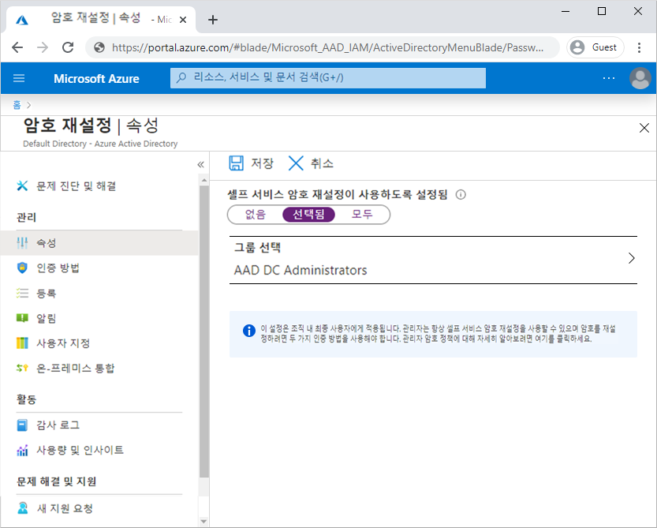
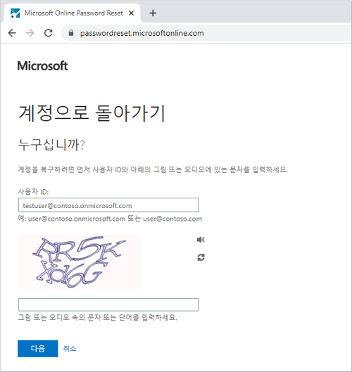

# 미니 랩: Azure AD 셀프 서비스 암호 재설정 사용

Azure AD(Azure Active Directory) SSPR(셀프 서비스 암호 재설정)은 관리자나 지원 센터 참여 없이 암호를 변경하거나 재설정할 수 있는 기능을 제공합니다. 사용자의 계정이 잠겨 있거나 암호를 잊어버린 경우 프롬프트를 따라 차단을 직접 해제하고 다시 작업할 수 있습니다. 이 기능은 사용자가 디바이스 또는 애플리케이션에 로그인할 수 없을 때 지원 센터 호출 및 생산성 손실을 줄입니다.

이 주제에서는 셀프 서비스 암호 재설정을 사용하도록 설정하는 방법을 보여줍니다. 

* Azure AD 사용자 그룹에 대한 셀프 서비스 암호 재설정 사용

* 인증 방법 및 등록 옵션 구성

* 사용자로서 SSPR 프로세스 테스트

## 전제 조건

이 미니 랩을 완료하려면 다음 리소스와 권한이 필요합니다.

* 최소한 평가판 라이선스가 활성화된 작업 중인 Azure AD 테넌트입니다. 

* 전역 관리자 권한이 있는 계정입니다.

* testuser와 같이 알려진 암호가 있는 비관리자 사용자입니다. 이 미니 랩에서 이 계정을 사용하여 최종 사용자 SSPR 환경을 테스트합니다. 

* 관리자가 아닌 사용자가 구성원인 그룹(예: SSPR-Test-Group)입니다. 이 미니 랩에서 이 그룹에 대한 SSPR을 사용하도록 설정합니다. 

## 셀프 서비스 암호 재설정 사용

Azure AD를 사용하면 없음, 선택됨 또는 모든 사용자에 대해 SSPR을 사용하도록 설정할 수 있습니다. 이 세분화된 기능을 사용하면 SSPR 등록 프로세스 및 워크플로를 테스트하기 위해 사용자의 하위 집합을 선택할 수 있습니다. 프로세스에 익숙하고 더 광범위한 사용자 집합과 요구 사항을 전달할 수 있는 경우 SSPR에 사용하도록 추가 사용자 그룹을 선택할 수 있습니다. 또는 Azure AD 테넌트의 모든 사용자에 대해 SSPR을 사용하도록 설정할 수 있습니다.

이 미니 랩에서는 테스트 그룹의 사용자 집합에 대해 SSPR을 구성합니다. 다음 예제에서는 SSPR-Test-Group 그룹이 사용됩니다. 필요에 따라 고유한 Azure AD 그룹을 제공합니다.

1. 글로벌 관리자 권한이 있는 계정을 사용하여 [Azure Portal](https://portal.azure.com/)에 로그인합니다.

2. **Azure Active Directory**를 검색하고 선택한 다음 왼쪽 메뉴에서 **암호 재설정**을 선택합니다.

3. **속성** 페이지에서 셀프 서비스 암호 재설정 옵션을 사용하도록 설정하여 **그룹 선택**을 선택합니다.

4. *SSPR-Test-Group*과 같은 Azure AD 그룹을 찾아 선택한 후 **다음**을 선택합니다.

    

    SSPR의 광범위한 배포의 일환으로 중첩된 그룹이 지원됩니다. 선택한 그룹의 사용자에게 적절한 라이선스가 할당되어 있는지 확인합니다. 현재 이러한 라이선스 요구 사항에 대한 유효성 검사 프로세스가 없습니다.

5. 선택한 사용자에 대해 SSPR을 사용하도록 설정하려면 **저장**을 선택합니다.

## 인증 방법 및 등록 옵션 선택

사용자가 계정의 잠금을 해제하거나 암호를 다시 설정해야 하는 경우 추가 확인 방법을 묻는 메시지가 표시됩니다. 이 추가 인증 요소는 승인된 SSPR 이벤트만 완료되었는지 확인합니다. 사용자가 제공하는 등록 정보에 따라 허용할 인증 방법을 선택할 수 있습니다.

1. 왼쪽 메뉴의 **인증 방법** 페이지에서 **재설정에 필요한 방법 개수**를 *1*로 설정합니다.

    보안을 향상시키기 위해 SSPR에 필요한 인증 방법 개수를 늘릴 수 있습니다.

2. 조직에서 허용하려는 **사용자가 사용할 수 있는 방법**을 선택합니다. 이 미니 랩의 경우 다음 방법을 사용하도록 확인란을 선택합니다.

    - *모바일 앱 알림*

    - *모바일 앱 코드*

    - *전자 메일*

    - *휴대폰*

    - *사무실 전화*

3. 인증 방법을 적용하려면 **저장**을 선택합니다.

    사용자가 계정의 잠금을 해제하거나 암호를 다시 설정하려면 먼저 연락처 정보를 등록해야 합니다. 이 연락처 정보는 이전 단계에서 구성한 다양한 인증 방법에 사용됩니다.

    관리자는 이 연락처 정보를 수동으로 제공하거나 사용자가 등록 포털로 이동하여 해당 정보를 직접 제공할 수 있습니다. 이 미니 랩에서는 다음에 로그인할 때 사용자에게 등록 메시지가 표시되도록 구성합니다.

1. 왼쪽 메뉴의 **등록** 페이지에서 **사용자가 로그인 시 등록하도록 요구하시겠습니까?**에 대해 예를 선택합니다.

2. 연락처 정보를 최신 상태로 유지하는 것이 중요합니다. SSPR 이벤트가 시작될 때 연락처 정보가 오래된 경우 사용자가 계정의 잠금을 해제하거나 암호를 다시 설정하지 못할 수 있습니다.

1. **사용자가 인증 정보를 다시 확인해야 하기 전의 일 수**를 *180*으로 설정합니다.

3. 등록 설정을 적용하려면 **저장**을 선택합니다.

## 알림 및 사용자 지정 구성

사용자에게 계정 활동에 대한 정보를 계속 제공하기 위해 SSPR 이벤트가 발생할 때 이메일 알림을 보내도록 구성할 수 있습니다. 이러한 알림에는 일반 사용자 계정과 관리자 계정이 모두 포함될 수 있습니다. 관리자 계정의 경우 이 알림은 SSPR을 사용하여 권한 있는 관리자 계정 암호가 다시 설정될 때 추가적인 인식 레이어를 제공합니다.

1. 왼쪽 메뉴의 **알림** 페이지에서 다음 옵션을 구성합니다.

    - **암호 재설정 시 사용자에게 알림 옵션**을 *예*로 설정합니다.

    - **다른 관리자가 비밀번호를 재설정하면 모든 관리자에게 알림**을 *예*로 설정합니다.

2. 알림 기본 설정을 적용하려면 **저장**을 선택합니다.

## 셀프 서비스 암호 재설정 테스트

SSPR을 활성화하고 구성한 상태에서 Test-SSPR-Group과 같이 이전 섹션에서 선택한 그룹의 일부인 사용자로 SSPR 프로세스를 테스트합니다. 다음 예제에서는 testuser 계정이 사용됩니다. 이 미니 랩의 첫 번째 섹션에서 SSPR에 사용하도록 설정한 그룹의 일부인 사용자 계정을 제공합니다.

>**메모**
셀프 서비스 암호 재설정을 테스트할 때 관리자가 아닌 계정을 사용합니다. 관리자는 항상 셀프 서비스 암호 재설정을 할 수 있으며 두 가지 인증 방법을 사용하여 암호를 재설정해야 합니다.

1. 수동 등록 프로세스를 보려면 InPrivate 또는 시크릿 모드에서 새 브라우저 창을 열고 [https://aka.ms/ssprsetup](https://aka.ms/ssprsetup)으로 이동합니다. 사용자는 다음에 로그인할 때 이 등록 포털로 이동해야 합니다.

2. testuser와 같은 관리자가 아닌 테스트 사용자로 로그인하고 인증 방법의 연락처 정보를 등록합니다.

3. 완료되면 **좋아요**가 표시된 단추를 선택하고 브라우저 창을 닫습니다.

4. InPrivate 또는 시크릿 모드에서 새 브라우저 창을 열고 [https://aka.ms/sspr](https://aka.ms/sspr)으로 이동합니다.

5. 관리자가 아닌 테스트 사용자의 계정 정보(예: testuser, CAPTCHA의 문자)를 입력하고 **다음**을 선택합니다.

    

6. 확인 단계에 따라 암호를 재설정하세요. 완료되면 암호가 재설정되었다는 이메일 알림을 받을 것입니다.
