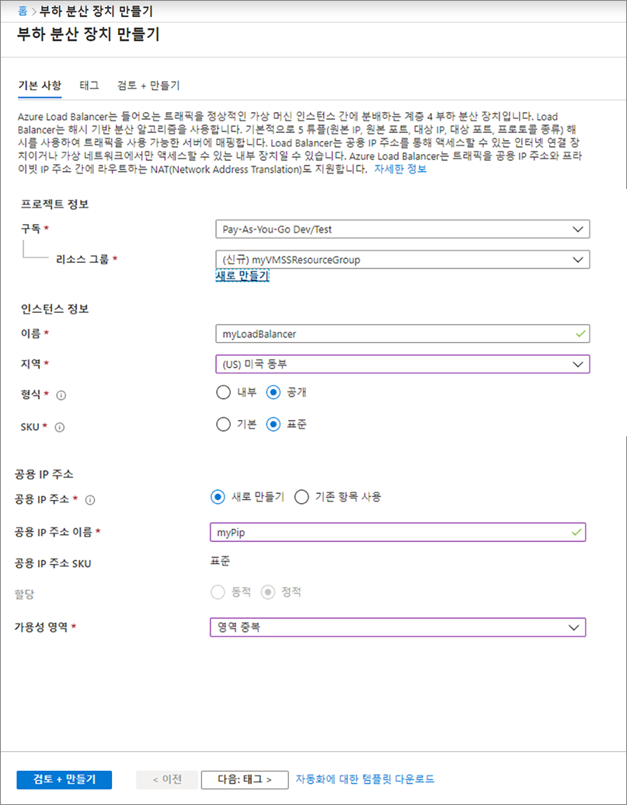
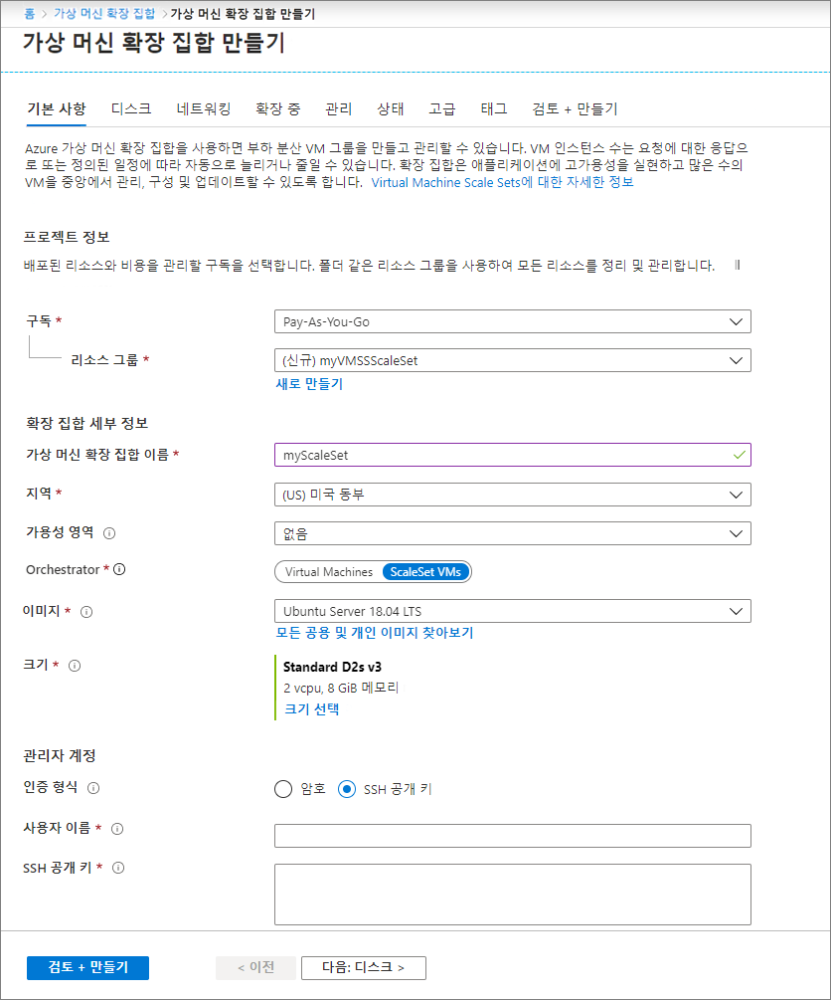

# 미니 랩: Azure Portal에서 VM 확장 집합 만들기

## 공용 부하 분산 장치 만들기

포털을 사용하여 공용 부하 분산 장치를 만듭니다. 만든 이름과 공용 IP 주소는 자동으로 부하 분산 장치의 프런트 엔드로 구성됩니다.

1. 검색 상자에서 *부하 분산 장치*를 입력합니다. 검색 결과의 **Marketplace**에서 **부하 분산 장치**를 선택합니다.

2. 부하 분산 장치 만들기 페이지의 **기본 사항** 탭에서 다음 정보를 입력하거나 선택합니다.

| 설정 	| 값 	|
|------------------------	|-----------------------------------------------------------------	|
| 구독 	| 사용자의 구독을 선택합니다. 	|
| 리소스 그룹 	| [새로 만들기]를 선택하고 텍스트 상자에 myVMSSResourceGroup를 입력합니다. 	|
| 이름 	| myLoadBalancer 	|
| 지역 	| [미국 동부]를 선택하세요. 	|
| 입력 	| [공용]을 선택하세요. 	|
| SKU 	| [표준]을 선택하세요. 	|
| 공용 IP 주소 	| 새로 만들기를 선택하세요. 	|
| 공용 IP 주소 이름 	| MyPip 	|
| 할당 	| 고정 	|
| 가용성 영역 	| 영역 중복 	|

3. **검토 + 만들기**를 선택합니다.

4. **만들기**를 선택합니다.

## 가상 머신 확장 집합 만들기

RHEL, CentOS, Ubuntu 또는 SLES와 같은 Windows Server 이미지 또는 Linux 이미지로 확장 집합을 배포할 수 있습니다.

1. 검색 상자에서 *확장 집합*을 입력합니다. 결과의 **Marketplace**에서 **Virtual Machine Scale Sets**를 선택합니다. **가상 머신 확장 집합 만들기** 페이지가 열립니다. 

2. **기본 사항** 탭의 **프로젝트 세부 정보**에서 올바른 구독을 선택했는지 확인한 다음 리소스 그룹 **새로 만들기**를 선택합니다. 이름에 *myVMSSResourceGroup*을 입력한 다음 확인을 선택합니다. 

3. *myScaleSet*을 확장 집합의 이름으로 입력합니다. 

4. **지역**에서 가까운 지역을 선택합니다.

5. **오케스트레이터**에서 **ScaleSet VMs**의 기본값을 그대로 둡니다.

6. **Image**에서 Marketplace 이미지를 선택하세요. 이 예제에서는 Ubuntu Server 18.04 LTS를 선택했습니다.

7. 원하는 사용자 이름을 입력하고 원하는 인증 유형을 선택합니다.

    - **암호**는 12자 이상이어야 하며 4가지의 복잡성 요구 사항(1개의 소문자, 1개의 대문자, 1개의 숫자 및 1개의 특수 문자) 중 3가지를 충족해야 합니다. 

    - Linux OS 디스크 이미지를 선택한 경우 대신 **SSH 공개 키**를 선택할 수 있습니다. ~/.ssh/id_rsa.pub과 같은 공개 키만 제공합니다. 포털에서 Azure Cloud Shell을 사용하여 SSH 키를 만들고 사용할 수 있습니다.

    

8. 다른 페이지로 이동하려면 **다음**을 선택하세요. 각 탭을 탐색하면서 생성되는 확장 집합에서 VM의 특성을 검토합니다.

9. **인스턴스** 및 **디스크** 탭을 검토하되, 기본값은 그대로 둡니다.

10. **네트워킹**페이지의 **부하 분산**에서 **예**를 선택하여 확장 집합 인스턴스를 부하 분산 장치 뒤에 배치합니다.     

11. **부하 분산 옵션**에서 **Azure 부하 분산 장치**를 선택합니다.   

12. **부하 분산 장치 선택**에서 이전에 만든 **myLoadBalancer**를 선택합니다.   

13. **백 엔드 풀 선택**에서 **새로 만들기**를 선택하고 *myBackendPool*을 입력한 다음 **만들기**를 선택합니다.

1. **크기 조정** 탭 및 **관리** 탭의 기본값을 검사합니다.

14. **검토 + 만들기**를 선택합니다.

15. 확장 집합을 배포하려면 **만들기**를 선택하세요. 

 ## 리소스 정리

 더 이상 필요하지 않은 경우 리소스 그룹, 확장 집합 및 모든 관련 리소스를 삭제하세요. 이렇게 하려면 확장 집합의 리소스 그룹을 선택한 다음 **삭제**를 선택합니다. 
