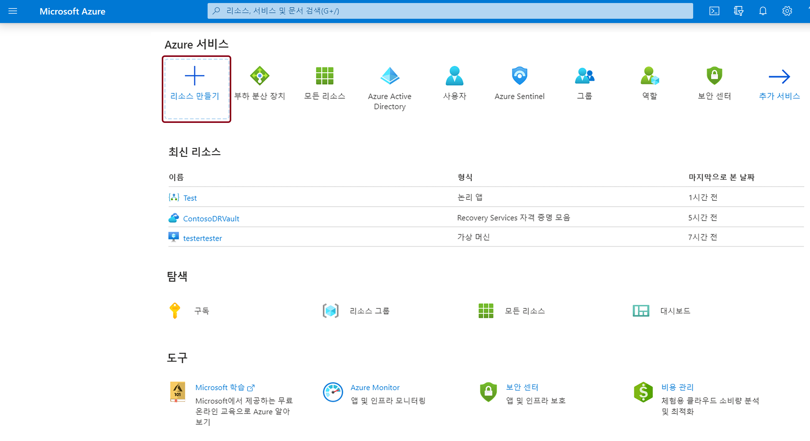
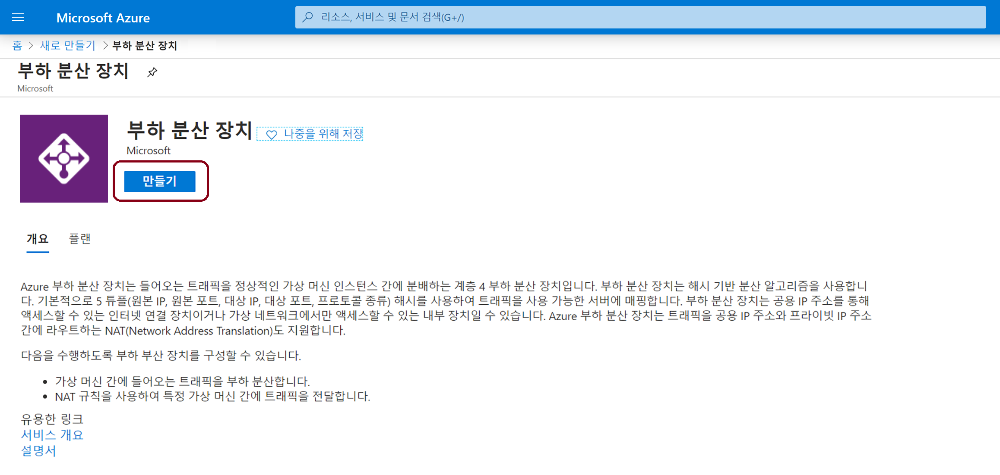
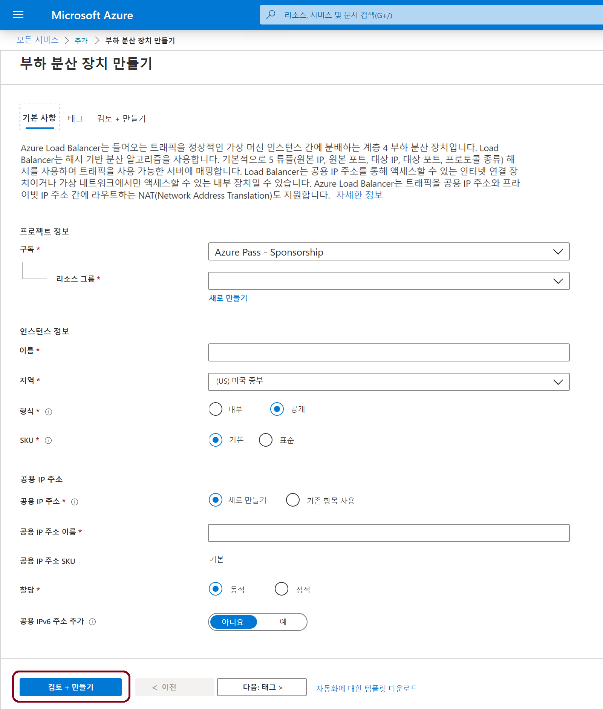
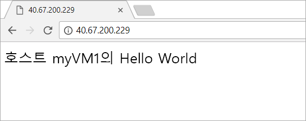

# 미니 랩: 부하 분산 VM에 부하 분산 장치 만들기

[https://portal.azure.com](https://portal.azure.com/)에서 Azure Portal에 로그인합니다.

## 부하 분산 장치 만들기

이 미니 랩에서는 가상 머신 부하 분산을 도와주는는 Load Balancer를 만듭니다. 공용 Load Balancer 또는 내부 Load Balancer를 만들 수 있습니다. 공용 Load Balancer를 만드는 경우 Load Balancer의 프런트 엔드(기본적으로 LoadBalancerFrontend로 명명됨)로 구성된 새 공용 IP 주소도 만듭니다.

1. **+ 리소스 만들기**를 선택하고 *부하 분산 장치*를 입력합니다.

.

2. **만들기**를 선택합니다.

.

3. **부하 분산 장치 만들기** 페이지의 **기본** 탭에서 다음 정보를 입력하거나 선택하고 나머지 설정은 기본값을 적용한 후에 **검토 + 만들기**를 선택합니다.



| 설정 | 값 |
|------------------------|---------------------------------------------------------------------------------------------------------------------------------------------------------------------------------------------------------------|
| 구독 | 사용자의 구독을 선택합니다. |
| 리소스 그룹 | **새로 만들기**를 선택하고 텍스트 상자에 *myResourceGroupSLB*를 입력합니다. |
| 이름 | *myLoadBalancer* |
| 지역 | **서유럽**을 선택합니다. |
| 입력 | **Public**을 선택합니다. |
| SKU | **표준** 또는 **기본**을 선택합니다. Microsoft는 프로덕션 워크로드에 대한 표준을 권장합니다. |
| 공용 IP 주소 | **새로 만들기**를 선택합니다. 사용하려는 기존 공용 IP가 있는 경우 **기존 사용**을 선택합니다. |
| 공용 IP 주소 이름 | 텍스트 상자에 *myPublicIP*를 입력합니다.   ```-SKU Basic```을 사용하여 기본 공용 IP를 만듭니다. 기본 공용 IP는 **표준** 부하 분산 장치와 호환되지 않습니다. Microsoft는 프로덕션 워크로드에 **표준**을 사용하도록 권장합니다. |
| 가용성 영역 | *영역 중복*을 입력하여 복원력 있는 Load Balancer를 만듭니다. 영역 Load Balancer를 만들려면 1, 2 또는 3에서 특정 영역을 선택합니다. |

>**중요**
이 미니 랩은 위의 SKU 선택 프로세스 중에 표준 SKU가 선택되었다고 가정합니다.


## Load Balancer 리소스 만들기

이 섹션에서는 백 엔드 주소 풀과 상태 프로브에 대한 Load Balancer 설정을 구성하고, 분산 장치 규칙을 지정합니다.

## 백 엔드 풀 만들기

VM에 트래픽을 분산하기 위해 백 엔드 주소 풀에는 부하 분산 장치에 연결된 가상 네트워크 인터페이스(NIC)의 IP 주소가 포함되어 있습니다. 인터넷 트래픽의 부하를 분산하기 위한 가상 머신을 포함하는 백 엔드 주소 풀 myBackendPool을 만듭니다.

1. 왼쪽 메뉴에서 **모든 서비스**를 선택하고 **모든 리소스**를 선택한 다음, 리소스 목록에서 **myLoadBalancer**를 선택합니다.

2. **설정**에서 **백 엔드 풀**을 선택한 다음, **추가**를 선택합니다.

3. **백 엔드 풀 추가** 페이지에서 이름에 백 엔드 풀의 이름으로 *myBackendPool*을 입력한 다음 **추가**를 선택합니다.

## 상태 프로브 만들기

Load Balancer가 앱의 상태를 모니터링할 수 있도록 하려면 상태 프로브를 사용합니다. 상태 프로브는 상태 검사의 응답에 따라 Load Balancer 순환에서 VM을 추가하거나 제거합니다. VM의 상태를 모니터링할 myHealthProbe라는 상태 프로브를 만듭니다.

1. 왼쪽 메뉴에서 **모든 서비스**를 선택하고 리소스 목록에서 **모든 리소스**를 선택한 다음 **myLoadBalancer**를 선택합니다.  

2. **설정** 아래에서 **상태 프로브**를 선택하고 **추가**를 선택합니다.

| 설정 | 값 |
|---------------------|-------------------------------------------------------------------------------------------------------------------------------|
| 이름 | *myHealthProbe*를 입력합니다. |
| 프로토콜 | **HTTP**를 선택합니다. |
| 포트 | *80*을 입력합니다. |
| 간격 | 프로브 시도 *간격*을 초 단위로 **15**로 입력합니다. |
| 비정상 임계값 | VM이 **비정상 임계값** 또는 VM이 비정상 상태로 간주되는 데 필요한 연속 프로브 오류 횟수로 **2**를 선택합니다. |


3. **확인**을 선택합니다.

## Load Balancer 규칙 만들기

Load Balancer 규칙은 트래픽이 VM으로 분산되는 방법을 정의하는 데 사용됩니다. 들어오는 트래픽용 프런트 엔드 IP 구성과 트래픽을 수신할 백 엔드 IP 풀, 그리고 필요한 원본 및 대상 포트를 정의합니다. myLoadBalancerRuleWeb Load Balancer 규칙을 만들어 프런트 엔드 FrontendLoadBalancer의 포트 80에서 수신 대기하고, 부하 분산된 네트워크 트래픽을 같은 포트 80에서 myBackendPool이라는 백 엔드 주소 풀로 보냅니다.

1. 왼쪽 메뉴에서 **모든 서비스**를 선택하고 **모든 리소스**를 선택한 다음, 리소스 목록에서 **myLoadBalancer**를 선택합니다.

2. **설정** 아래에서 **부하 분산 규칙**을 선택한 다음 **추가**를 선택합니다.

3.다음 값을 사용하여 부하 분산 규칙을 구성합니다.

| 설정 | 값 |
|--------------|-----------------------|
| 이름 | *myHTTPRule*을 입력합니다. |
| 프로토콜 | **TCP**를 선택합니다. |
| 포트 | *80*을 입력합니다. |
| 백 엔드 포트 | *80*을 입력합니다. |
| 백 엔드 풀 | **myBackendPool**을 선택합니다. |
| 상태 프로브 | **myHealthProbe**를 선택합니다. |


4. 나머지 기본값은 그대로 두고 **확인**을 선택합니다.

## 백 엔드 서버 만들기

이 섹션에서는 가상 네트워크를 만들고 부하 분산 장치의 백 엔드 풀에 대한 세 개의 가상 머신를 만든 다음 가상 머신에 IIS를 설치하여 Load Balancer 테스트를 지원합니다.

## 가상 네트워크 및 매개 변수

이 섹션에서는 다음 단계의 매개 변수를 아래 정보로 대체해야 합니다.

| 매개 변수 | 값 |
|------------------------|--------------------|
| **resource-group-name** | myResourceGroupSLB |
| **virtual-network-name** | myVNet |
| **region-name** | 서유럽 |
| **IPv4-address-space** | 10.1.0.0\16 |
| **subnet-name** | myBackendSubnet |
| **subnet-address-range** | 10.1.0.0\24 |


## 가상 네트워크 만들기

이 섹션에서는 가상 네트워크와 서브넷을 만듭니다.

1. 화면 왼쪽 상단에서 **리소스 만들기 > 네트워킹 > 가상 네트워크**를 선택하거나 검색 상자에서 *가상 네트워크*를 검색합니다.

2. **가상 네트워크 만들기**에서 **기본** 탭에 있는 정보를 입력하거나 선택합니다.

| 설정 | 값 |
|------------------|----------------------------------------------------------------------------------------------------------------------------------|
| **프로젝트 세부 정보** |  |
| 구독 | Azure 구독을 선택 |
| 리소스 그룹 | **새로 만들기**를 선택하거나 **resource-group-name**을 입력한 다음 **확인**을 선택하거나 매개 변수를 기반으로 기존 **resource-group-name**을 선택합니다. |
| **인스턴스 세부 정보** |  |
| 이름 | **virtual-network-name** 입력 |
| 지역 |  **region-name** 선택 |

3. **IP 주소** 탭을 선택하거나 페이지 하단의 **다음: IP 주소** 단추를 선택합니다.

4. **IP 주소** 탭에서 다음 정보를 입력합니다:

| 설정 | 값 |
|--------------------|----------------------------|
| IPv4 주소 공간 | **IPv4-address-space** 입력 |


5. **서브넷 이름** 아래에서 **기본값**이라는 단어를 선택합니다.

6. **서브넷 편집**에서 다음 정보를 입력합니다.

| 설정 | 값 |
|----------------------|------------------------------|
| 서브넷 이름 | **subnet-name** 입력 |
| 서브넷 주소 범위 | **subnet-address-range** 입력 |


7. **저장**을 선택합니다.

8. **검토 + 만들기** 탭을 선택하거나 **검토 + 만들기** 단추를 선택합니다.

9. **만들기**를 선택합니다.

## 가상 머신 만들기

공용 IP SKU 및 Load Balancer SKU가 일치해야 합니다. 표준 Load Balancer의 경우 백 엔드 풀에서 표준 IP 주소가 있는 VM을 사용합니다. 이 섹션에서는 세 개의 다른 영역(*영역 1, 영역 2* 및 *영역 3*)에서 표준 공용 IP 주소를 사용하여 세 개의 VM(*myVM1, myVM2* 및 *myVM3*)을 만들며 이러한 VM은 이전에 만든 Load Balancer의 백 엔드 풀에 추가됩니다. 기본을 선택한 경우 기본 IP 주소가 있는 VM을 사용합니다.

1. 포털의 왼쪽 위에서 **리소스 만들기 > 컴퓨팅 > Windows Server 2019 Datacenter**를 선택합니다.

2. **가상 머신 만들기**의 **기본** 탭에서 다음 값을 입력하거나 선택합니다.

- **구독 > 리소스 그룹**: **myResourceGroupSLB**를 선택합니다.

- **인스턴스 세부 정보 > 가상 머신** 이름: *myVM1*을 입력합니다.

- **인스턴스 세부 정보 > 지역** > 에서 **서유럽**을 선택합니다.

- **인스턴스 세부 정보 > 가용성 옵션** > 에서 **가용성 영역**을 선택합니다.

- **인스턴스 세부 정보 > 가용성 영역** > 에서 **1**을 선택합니다.

- **관리자 계정** > **사용자 이름, 암호** 및 **암호 확인** 정보를 입력합니다.

- **네트워킹** 탭을 선택하거나 **다음:디스크**을 **다음: 네트워킹**을 차례로 선택합니다.

3. **네트워킹** 탭에서 다음을 선택했는지 확인합니다.

- **가상 네트워크**: *myVnet*

- **서브넷**: *myBackendSubnet*

- **공용 IP** > 에서 **새로 만들기**를 선택합니다. **공용 IP 주소 만들기** 창에서 **SKU**에 **표준**을 선택하고 **가용성 영역**에 **영역 중복**을 선택한 다음 **확인**을 선택합니다. 기본 Load Balancer를 만드는 경우 기본을 선택합니다. Microsoft는 프로덕션 워크로드에 표준 SKU를 사용하는 것을 권장합니다.

- 방화벽의 한 유형인 네트워크 보안 그룹(NSG)을 만들려면 **네트워크 보안 그룹**에서 **고급**을 선택합니다. 

1. **네트워크 보안 그룹 구성** 필드에서 **새로 만들기**를 선택합니다.

2. *myNetworkSecurityGroup*을 입력하고 **확인**을 선택합니다.

- VM을 Load Balancer의 백 엔드 풀에 포함하려면 다음 단계를 완료하세요. 
	
	- **부하 분산**에서 **기존 부하 분산 솔루션 뒤에 이 가상 머신을 배치하시겠습니까?** 에 **예**를 선택합니다.
	
	- **부하 분산 설정**에서 **부하 분산 옵션**에 **Azure 부하 분산 장치**를 선택합니다.
	
	- **부하 분산 장치 선택**에서 *myLoadBalancer*를 선택합니다.
	
	- **관리** 탭을 선택하거나 **다음 > 관리**를 선택합니다.

4. **관리** 탭에서 **모니터링**의 **부트 진단**을 **끄기**로 설정합니다.

5. **검토 + 만들기**를 선택합니다.

6. 설정을 검토한 다음 **만들기**를 선택합니다.

7. 2~6단계에 따라 다음 값 및 *myVM1*과 동일한 다른 모든 설정을 사용하여 두 개의 추가 VM을 만듭니다.

| 설정 | VM 2 | VM 3 |
|-------------------------------|---------------------------------------------|---------------------------------------------|
| 이름 | *myVM2* | *myVM3* |
| 가용성 영역 | 2 | 3 |
| 공용 IP | **표준** SKU | **표준** SKU |
| 공용 IP - 가용성 영역 | **영역 중복** | **영역 중복** |
| 네트워크 보안 그룹 | 기존 *myNetworkSecurity Group* 선택 | 기존 *myNetworkSecurity Group* 선택 |
|  |  |  |


## NSG 규칙 만들기

이 섹션에서는 HTTP를 사용하여 인바운드 연결을 허용하는 네트워크 보안 그룹 규칙을 만듭니다.

1. 왼쪽 메뉴에서 **모든 서비스**를 선택합니다. **모든 리소스**를 선택한 다음, 리소스 목록에서 **myResourceGroupSLB** 리소스 그룹에 있는 **myNetworkSecurityGroup**을 선택합니다.

2. **설정**에서 **인바운드 보안 규칙**, **추가**를 차례로 선택합니다.

3. 포트 **80**을 사용하는 인바운드 HTTP 연결을 허용하도록 **myHTTPRule**이라는 인바운드 보안 규칙에 다음 값을 입력합니다. 

- **원본**: *서비스 태그*

- **원본 서비스 태그**: *인터넷*

- **대상 포트 범위**: *80*

- **프로토콜**: *TCP*

- **동작**: *허용*

- **우선 순위**: *100*

- **이름**: *myHTTPRule*

- **설명**: *HTTP 허용*

4. **추가**를 선택합니다.

5. 필요한 경우 다음과 같은 값으로 인바운드 RDP 규칙에 대한 단계를 반복합니다. 

- **대상 포트 범위**: *3389를 입력합니다*.

- **우선 순위**: *200*을 입력합니다.

- **이름**:  *MyRDPRule*을 입력합니다.

- **설명**: *RDP 허용*을 입력합니다.

## IIS 설치

1. 왼쪽 메뉴에서 **모든 서비스**를 선택하고 **모든 리소스**에서 *myResourceGroupLB* 리소스 그룹에 있는 **myVM1**을 클릭합니다.

2. **개요** 페이지에서 **연결**을 클릭하여 VM에 RDP로 연결합니다.

3. 이 VM을 만드는 동안 제공한 자격 증명으로 VM에 로그인합니다. 이렇게 하면 가상 머신 *- myVM1* 원격 데스크톱 세션이 시작됩니다.

4. 서버 데스크톱에서 **Windows 관리 도구>Windows PowerShell**로 이동합니다.

5. PowerShell 창에서 다음 명령을 실행하여 IIS 서버를 설치하고 기본 iisstart.htm 파일을 제거한 다음, VM의 이름을 표시하는 새 iisstart.htm 파일을 추가합니다.

```PowerShell
# IIS 서버 역할 설치
 Install-WindowsFeature -name Web-Server -IncludeManagementTools

 # 기본 htm 파일 제거
  remove-item  C:\inetpub\wwwroot\iisstart.htm

 # 서버 이름이 표시되는 새 htm 파일 추가
  Add-Content -Path "C:\inetpub\wwwroot\iisstart.htm" -Value $("Hello World from " + $env:computername)
```

6. *myVM1*로 RDP 세션을 닫습니다.

7. IIS와 *myVM2* 및 *myVM3*에 업데이트 된 iisstart.htm 파일을 설치하려면 1단계에서 6단계를 반복합니다.

## Load Balancer 테스트

1. **개요** 화면에서 Load Balancer의 공용 IP 주소를 찾습니다. 왼쪽 메뉴의 **모든 서비스**를 선택하고 **모든 리소스**를 선택한 다음, **myPublicIP**를 선택합니다.

2. 공용 IP 주소를 복사한 다음 브라우저의 주소 표시줄에 붙여넣습니다. IIS 웹 서버의 기본 페이지가 브라우저에 표시됩니다.



Load Balancer가 세 개의 VM에서 트래픽이 분산되는 것을 보려면 각 VM IIS 웹 서버의 기본 페이지를 사용자 지정한 다음 클라이언트 컴퓨터에서 웹 브라우저를 강제 새로 고침하면 됩니다.
