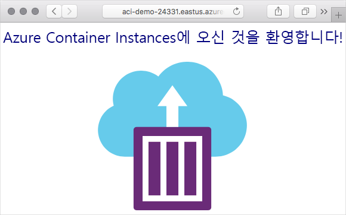

# 미니 랩: Azure Container Instances 실행

이 랩에서는 Azure에서 컨테이너를 만들고 FQDN(정규화된  도메인 이름)으로 인터넷에 노출합니다.

Azure Container Instances는 간단한 애플리케이션, 작업 자동화 및 빌드 작업 등 격리된 컨테이너에서 작동할 수 있는 모든 시나리오에 적합합니다. 다음은 몇 가지 이점입니다.

* **빠른 시작**: 몇 초 안에 컨테이너를 시작합니다.

* **초당 청구**: 컨테이너가 실행되는 동안에만 비용이 발생합니다.

* **하이퍼바이저 수준 보안**: VM에서처럼 애플리케이션을 완전히 격리합니다.

* **사용자 지정 크기**: CPU 코어 및 메모리의 정확한 값을 지정합니다.

* **영구적 스토리지**: Azure Files 공유를 직접 컨테이너에 탑재하여 상태를 검색하고 유지합니다.

* **Linux 및 Windows**: 동일한 API를 사용하여 Windows 및 Linux 컨테이너를 모두 예약합니다.

여러 컨테이너에서 서비스 검색, 자동 크기 조정 및 조정된 애플리케이션 업그레이드 등 전체 컨테이너 오케스트레이션이 필요한 경우, AKS(Azure Kubernetes Service)를 권장합니다.

## 컨테이너 만들기

1. Azure 구독을 사용하여 Azure Portal [https://portal.azure.com](https://portal.azure.com/) 에 로그인합니다.

2. Cloud Shell 아이콘을 사용하여 Azure Portal에서 Azure Cloud Shell을 엽니다.


3. 모듈을 완료하면 이러한 리소스를 정리하는 것이 더 쉬워지도록 **learn-deploy-aci-rg**라는 이름으로 새 리소스 그룹을 만듭니다. 다른 리소스 그룹 이름을 선택하면 이 모듈의 나머지 연습에 대해 기억하세요. 또한 리소스 그룹을 만들 지역(예: **미국 동부**)을 선택해야 합니다.

```Azure CLI
az group create --name learn-deploy-aci-rg --location eastus
```

이름, Docker 이미지 및 Azure 리소스 그룹을 ```az container create``` 명령에 제공하여 컨테이너를 만듭니다. 필요에 따라 DNS 이름 레이블을 지정하여 컨테이너를 인터넷에 노출할 수 있습니다. 이 예제에서는 작은 웹앱을 호스팅하는 컨테이너를 배포합니다. 이미지를 배치할 위치를 선택할 수도 있으며, **미국 동부** 지역을 사용할 예정이지만 가까운 위치로 변경할 수 있습니다.

4. DNS 이름을 제공하여 컨테이너를 인터넷에 노출합니다. DNS 이름은 고유해야 합니다. 학습 목적으로, Cloud Shell에서 이 명령을 실행하여 고유한 이름을 포함하는 Bash 변수를 만듭니다.

```Azure CLI
DNS_NAME_LABEL=aci-demo-$RANDOM
```

5. 다음 ```az container create``` 명령을 실행하여 컨테이너 인스턴스를 시작합니다.

```Azure
az container create \
  --resource-group learn-deploy-aci-rg \
  --name mycontainer \
  --image microsoft/aci-helloworld \
  --ports 80 \
  --dns-name-label $DNS_NAME_LABEL \
  --location eastus
```

```$DNS_NAME_LABEL```은 DNS 이름을 지정합니다. 이미지 이름 **microsoft/aci-helloworld**는 기본 Node.js 웹 애플리케이션을 실행하는 Docker Hub에 호스팅된 Docker 이미지를 나타냅니다.

6. ```az container create``` 명령이 완료되면 ```az container show```를 실행하여 상태를 확인합니다.

```Azure CLI
az container show \
  --resource-group learn-deploy-aci-rg \
  --name mycontainer \
  --query "{FQDN:ipAddress.fqdn,ProvisioningState:provisioningState}" \
  --out table
```

컨테이너의 FQDN(정규화된 도메인 이름) 및 해당 프로비전 상태를 확인합니다. 아래에 예가 나와 있습니다.

```Output
FQDN ProvisioningState

-------------------------------------- -------------------

aci-demo.eastus.azurecontainer.io Succeeded
```

컨테이너가 **만들기** 상태에 있는 경우 잠시 기다렸다가 **성공** 상태가 표시될 때까지 명령을 다시 실행합니다.

7. 브라우저에서 컨테이너의 FQDN으로 이동하여 실행 중인지 확인합니다.


