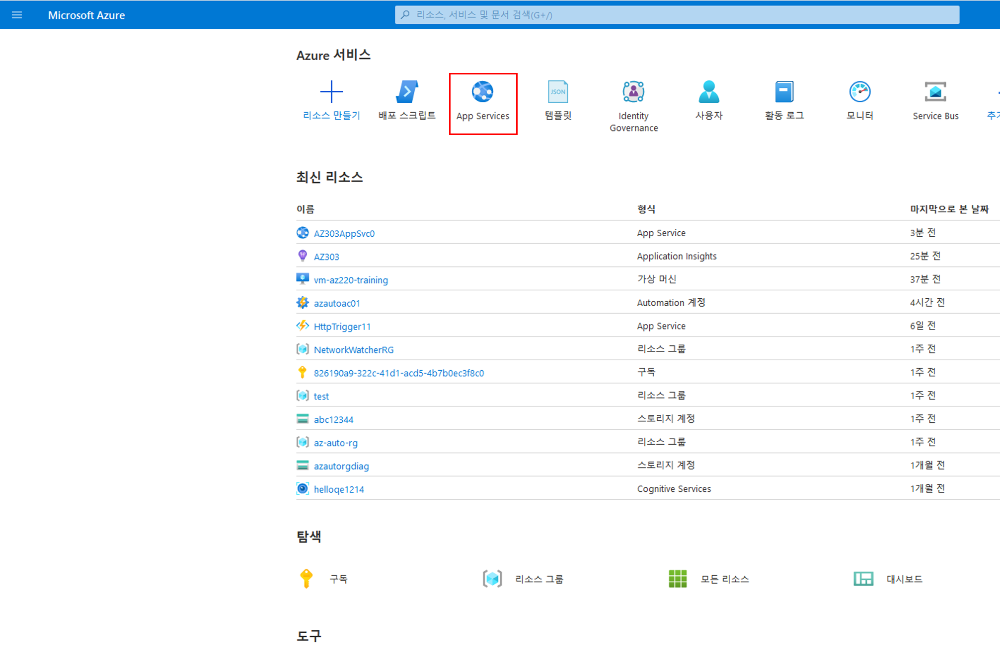
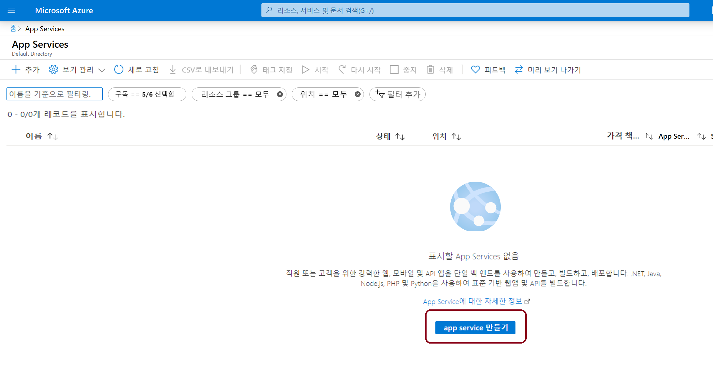
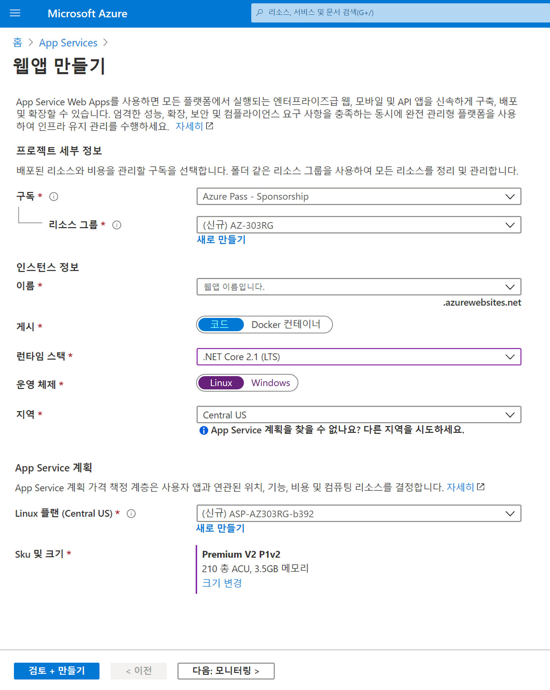
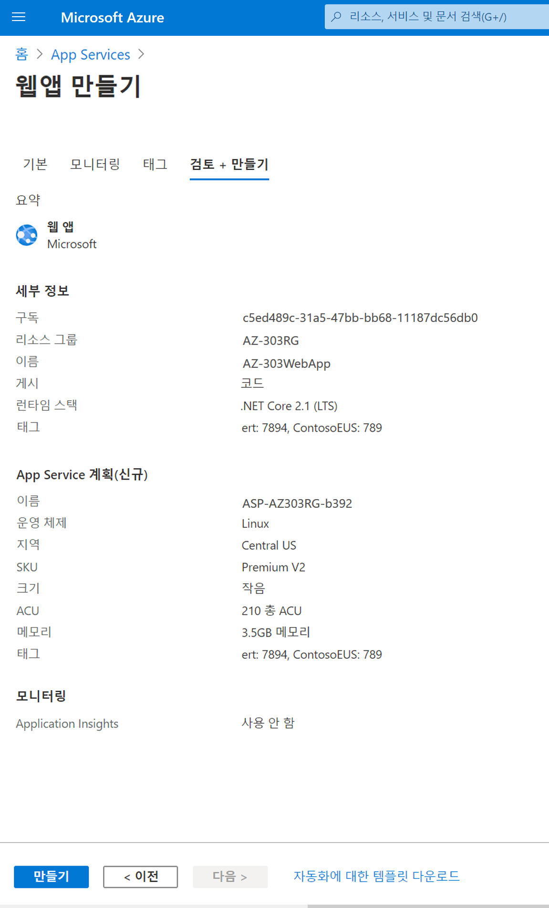
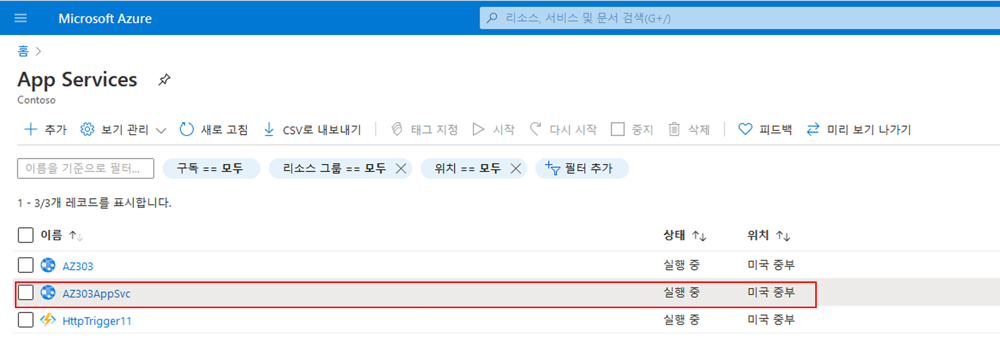
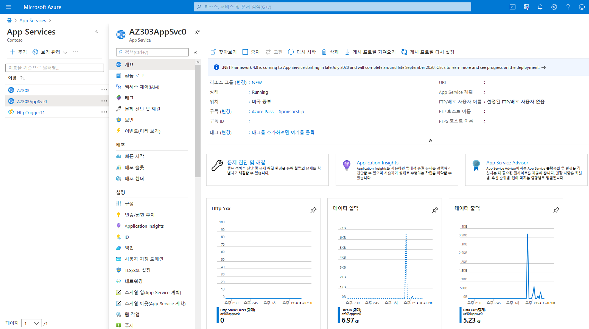

# 미니 랩: App Service 및 웹앱 만들기

이 데모에서는 Azure Portal을 사용하여 웹앱과 Azure App Service를 만듭니다.

## App Service 및 웹앱 만들기

1. [https://portal.azure.com](https://portal.azure.com/)에서 Azure Portal에 로그인합니다.

1. Azure Portal 메뉴 또는 **홈** 페이지에서 **App Services**를 선택합니다. 

    

2. **App Services 페이지**에서 **App Service 만들기**를 선택합니다. 

    

3. **웹앱**에서 다음 값을 완료합니다.

| 필드 | 값 | 세부 정보 |
|------------------|-----------------------------------------------|-------------------------------------------------------------------------------------------------------------------------------------------------------------------------------------------------------------------------------------------------------------------------------------------------------------------------|
| 구독 | 보유한 구독 선택 | 만드는 웹앱은 리소스 그룹에 속해야 합니다. 여기서 리소스 그룹이 속한 (또는 마법사 내에서 리소스를 만드는 경우 속하게 될) Azure 구독을 선택합니다. |
| 리소스 그룹 | 메뉴에서 선택 | 웹앱이 속할 리소스 그룹입니다. 모든 Azure 리소스는 리소스 그룹에 속해야 합니다. |
| 이름 | 고유한 이름 입력 | 웹앱의 이름입니다. 이 이름은 앱 URL(appname.azurewebsites.net)의 일부가 됩니다. 선택한 이름은 Azure 웹앱 전체에서 고유해야 합니다. |
| 게시 | 코드 | 애플리케이션을 게시하는 데 사용할 메서드입니다. 애플리케이션을 코드로 게시할 때 앱을 실행할 App Service 리소스를 준비하도록 런타임 스택도 구성해야 합니다. |
| 런타임 스택 | .NET Core 3.1 (LTS) | 애플리케이션이 실행되는 플랫폼입니다. 사용자의 선택은 운영 체제 선택 여부에 영향을 미칠 수 있습니다. 일부 런타임 스택의 경우 App Service는 하나의 운영 체제만 지원합니다. |
| 운영 체제 | Linux | 앱을 실행하는 가상 서버에서 사용되는 운영 체제입니다. |
| 지역 | 미국 중부 | 앱이 호스팅될 지역입니다. |
| Linux 계획 | 기본값 유지 | 앱을 구동할 App Service 계획의 이름입니다. 기본적으로 마법사는 웹앱과 동일한 영역에서 새 계획을 만듭니다. |
| SKU 및 크기 | 기본값 | 만들어진 요금제의 가격 책정 계층입니다. 앱을 구동하는 가상 서버의 성능 특성과 앱이 액세스할 수 있는 기능이 결정됩니다. F1 계층을 선택하려면 크기 변경을 선택하여 사양 선택 마법사를 엽니다. Dev / Test 탭의 목록에서 F1을 선택한 다음 적용을 선택합니다. |

4. **검토 및 만들기**를 선택하여 검토 페이지로 이동한 다음 **만들기**를 선택하여 웹앱을 만듭니다.

    

> **참고**: 웹앱을 만들고 사용할 준비를 하는 데 몇 초 정도 걸릴 수 있습니다.

포털에는 배포 상태를 볼 수 있는 배포 페이지가 표시됩니다. 

## 웹앱 미리 보기

앱이 준비되면 Azure Portal의 새 앱으로 이동합니다.

1. Azure Portal 메뉴 또는 **홈페이지**에서 **모든 리소스**를 선택합니다.

2. 목록에서 웹앱용 App Service를 선택합니다. App Service 계획이 아닌 App Service를 선택해야 합니다.

    

    포털에는 **App Services** 개요 페이지가 표시됩니다.

    

1. 새 웹앱의 기본 콘텐츠를 미리 보려면 오른쪽 상단에서 해당 URL을 선택합니다. 로드되는 자리 표시자 페이지는 웹앱이 시작되어 실행 중이며 앱 코드 배포를 받을 준비가 되었음을 나타냅니다.

    

 
