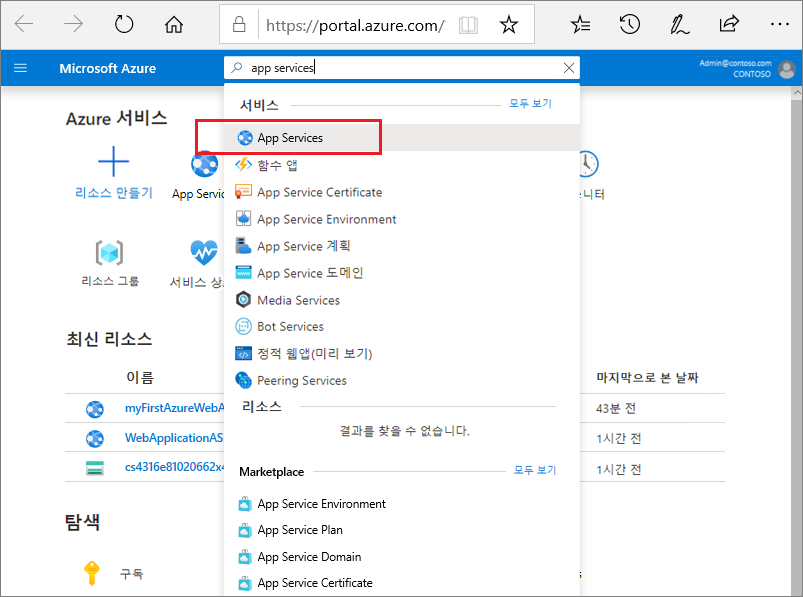
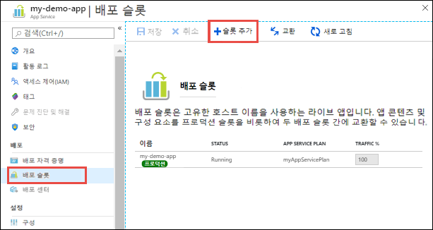
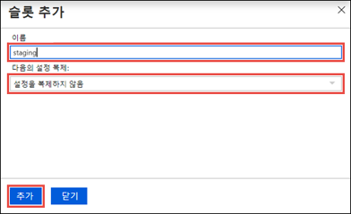
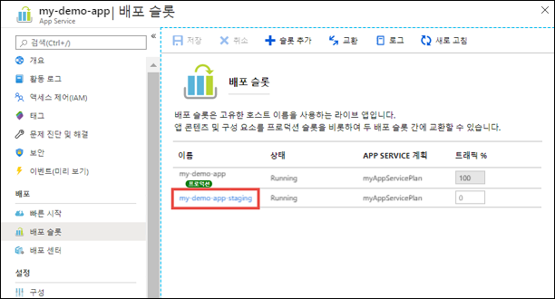
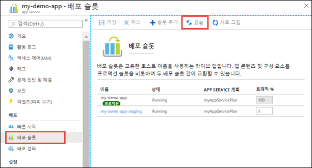
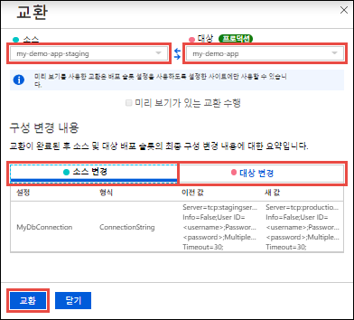

# 미니 랩: 스테이징 슬롯 배포

애플리케이션을 프로덕션 슬롯이 아닌 곳에 배포하면 다음과 같은 이점이 있습니다.

* 프로덕션 슬롯으로 교환하기 전에 준비 배포 슬롯에서 앱 변경 내용의 유효성을 검사할 수 있습니다.
* 먼저 슬롯에 앱을 배포한 다음 프로덕션으로 교환하면 프로덕션으로 교환되기 전에 해당 슬롯의 모든 인스턴스가 준비됩니다. 그러므로 앱을 배포할 때 가동 중지 시간이 제거됩니다. 트래픽도 원활하게 리디렉션되며 전환 작업으로 인해 요청이 삭제되지도 않습니다. 교환 전 유효성 검사가 필요하지 않은 경우 [자동 교환](#Auto-Swap)을 구성하여 전체 워크플로를 자동화할 수 있습니다.
* 전환 후에는 이전에 준비된 앱이 있던 슬롯에 이전의 프로덕션 앱이 있게 됩니다. 프로덕션 슬롯으로 교환된 변경 내용이 예상과 다른 경우에는 즉시 동일한 교환 작업을 수행하여 "마지막 성공한 위치"로 되돌릴 수 있습니다.

## 슬롯 추가
여러 배포 슬롯을 사용하려면 앱이 **표준**, **프리미엄** 또는 **격리** 계층에서 실행되고 있어야 합니다.

1. [https://portal.azure.com](https://portal.azure.com/)에서 Azure Portal에 로그인합니다. **App Services**를 검색하여 선택한 다음 앱을 선택합니다. 
   
    
   
2. 왼쪽 창에서 **배포 슬롯** > **슬롯 추가**를 선택합니다.
   
    
   
   > **참고:** **표준**, **프리미엄** 또는 **격리** 계층에 이미 앱이 있지 않은 경우, 준비된 게시를 사용하도록 설정하기 위해 지원되는 계층을 알려 주는 메시지가 표시됩니다. 이 시점에서 계속하려면 **업그레이드**를 선택하고 앱의 **크기 조정** 탭으로 이동할 수 있습니다.

3. **슬롯 추가** 대화 상자에서 슬롯에 이름을 지정하고 다른 배포 슬롯에서 앱 구성을 복제할지 여부를 선택합니다. **추가**를 선택하여 계속합니다.
   
    
   
    어느 기존 슬롯에서든 구성을 복제할 수 있습니다. 복제할 수 있는 설정에는 앱 설정, 연결 문자열, 언어 프레임워크 버전, 웹 소켓, HTTP 버전 및 플랫폼 비트 수가 포함됩니다.

4. 슬롯을 추가한 후 **닫기**를 선택하여 대화 상자를 닫습니다. 이제 **배포 슬롯** 페이지에 새 슬롯이 표시됩니다. 기본적으로 **트래픽 %** 는 새 슬롯에 대해 0으로 설정되며 고객 트래픽은 모두 프로덕션 슬롯으로 라우팅됩니다.

5. 해당 슬롯의 리소스 페이지를 열려면 새 배포 슬롯을 선택합니다.
   
    

    스테이징 슬롯에는 다른 App Service 앱과 마찬가지로 관리 페이지가 있습니다. 여기에서 슬롯의 구성을 변경할 수 있습니다. 배포 슬롯을 보고 있음을 상기시키기 위해 앱 이름은 **\<app-name>/\<slot-name>** 으로, 앱 유형은 **App Service(슬롯)** 으로 표시됩니다. 동일한 지정을 가진 리소스 그룹의 슬롯을 별도의 앱으로 볼 수도 있습니다.

다른 슬롯에서 설정을 복제하더라도 새 배포 슬롯에는 콘텐츠가 없습니다. 예를 들어 Git을 사용하여 이 슬롯에 게시할 수 있습니다. 다른 리포지토리 분기 또는 전혀 다른 리포지토리의 슬롯에 배포할 수 있습니다.

## 슬롯 2개 교환 
앱의 **배포 슬롯** 페이지와 **개요** 페이지에서 배포 슬롯을 교환할 수 있습니다.

> **중요:** 배포 슬롯에서 프로덕션으로 앱을 교환하기 전에, 프로덕션이 대상 슬롯이고 원본 슬롯에 있는 모든 설정이 프로덕션에서 원하는대로 정확히 구성되었는지 확인합니다.

배포 슬롯을 교환하려면

1. 앱의 **배포 슬롯** 페이지로 이동하여 **교환**을 선택합니다.
   
    

    **교환** 대화 상자에 변경될 예정인, 선택한 원본과 대상 슬롯의 설정이 표시됩니다.

2. 원하는 **원본** 및 **대상** 슬롯을 선택합니다. 일반적으로 대상은 프로덕션 슬롯입니다. 또한, **원본 변경** 및 **대상 변경** 탭을 선택하고 구성 변경이 예상되는지 확인합니다. 완료되면 **교환**을 선택하여 슬롯을 즉시 교환할 수 있습니다.

    

3. 완료되면 **닫기**를 선택하여 대화 상자를 닫습니다.
