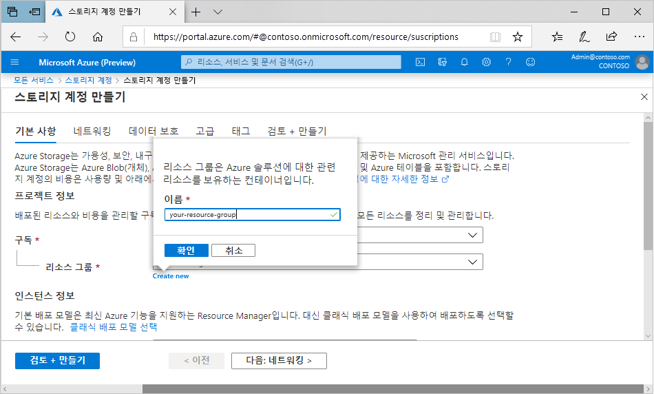

# 미니 랩: 포털에서 스토리지 계정 만들기

모든 스토리지 계정은 Azure 리소스 그룹에 속해야 합니다. 리소스 그룹은 Azure 서비스 그룹화를 위한 논리적 컨테이너입니다. 스토리지 계정을 만들 때는 새 리소스 그룹을 만들거나 기존 리소스 그룹을 사용할 수 있습니다. 이 문서에서는 새 리소스 그룹을 만드는 방법을 설명합니다.

범용 v2 스토리지 계정을 사용하면 Blob, 파일, 큐, 테이블, 디스크 등의 모든 Azure Storage 서비스에 액세스할 수 있습니다. 이 단계에서는 범용 v2 스토리지 계정을 만들지만 모든 스토리지 계정 유형을 만드는 단계는 비슷합니다.

Azure Portal에서 범용 v2 스토리지 계정을 만들려면 아래 단계를 따르세요.

1. Azure Portal 메뉴에서 **모든 서비스**를 선택합니다. 리소스 목록에서 **스토리지 계정**을 입력합니다. 입력을 시작하면 입력에 따라 목록이 필터링됩니다. **스토리지 계정**을 선택합니다.

1. **스토리지 계정** 창이 나타나면 **추가**를 선택합니다.

1. 스토리지 계정을 만들 구독을 선택합니다.

1. **리소스 그룹** 필드에서 **새로 만들기**를 선택합니다. 다음 이미지와 같이 새 리소스 그룹의 이름을 입력합니다.

    

1. 그런 다음 스토리지 계정의 이름을 입력합니다. 선택한 이름은 Azure 전체에서 고유해야 합니다. 또한 이름은 3~24자로 입력해야 하며, 숫자와 소문자만 사용할 수 있습니다.

1. 스토리지 계정의 위치를 선택하거나 기본 위치를 사용합니다.

1. 다음 필드는 기본값으로 설정된 상태로 유지합니다.

    | 필드| 값|
    | :--- | :--- |
    | 배포 모델| Resource Manager|
    | 성능| 표준|
    | 계정 종류| StorageV2(범용 v2)|
    | 복제| RA-GRS(읽기 액세스 지역 중복 스토리지)|
    | 액세스 계층| 핫|

1. **검토 + 만들기**를 선택하여 스토리지 계정 설정을 검토하고 계정을 만듭니다.

1. **만들기**를 선택합니다.

>:heavy_check_mark: **참고:** 이 모듈의 후반부에 나오는 다른 데모/연습에서 이 데모 중에 만든 스토리지 계정을 사용합니다.
