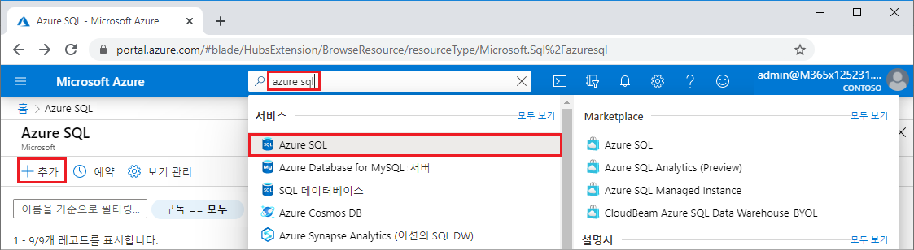
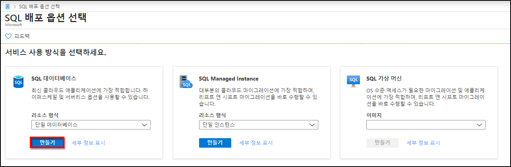
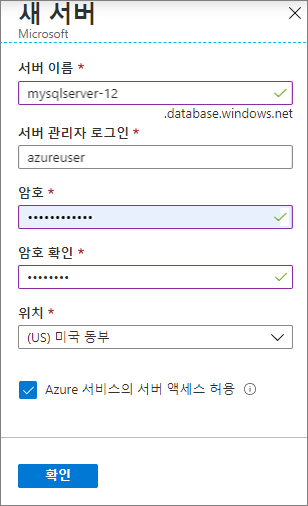
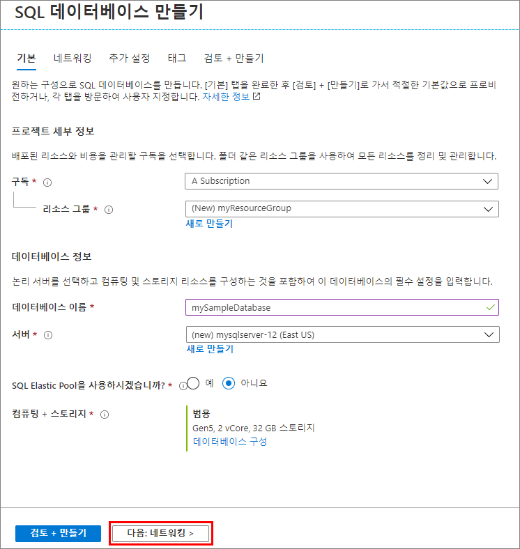
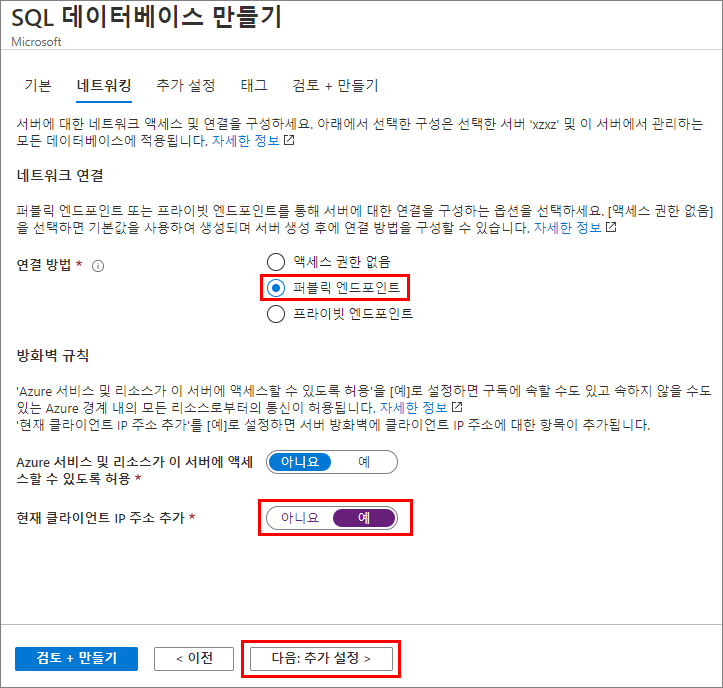
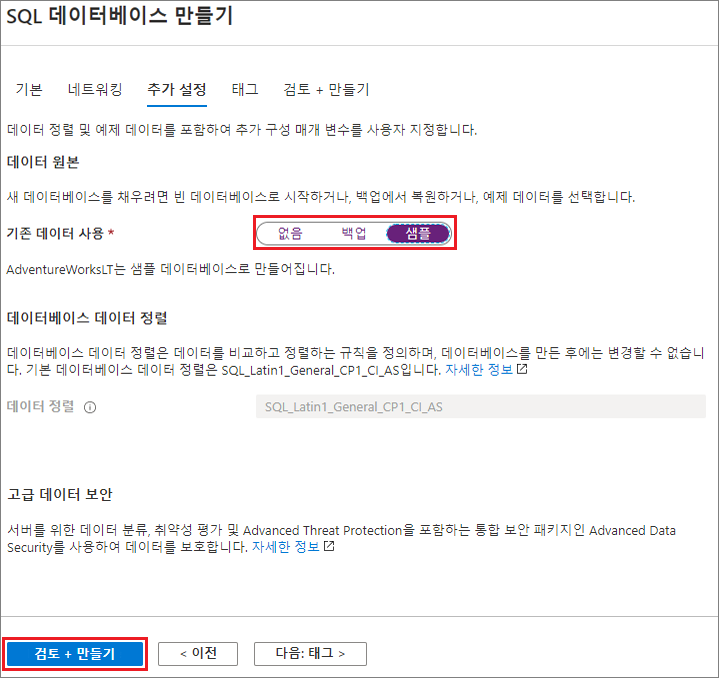
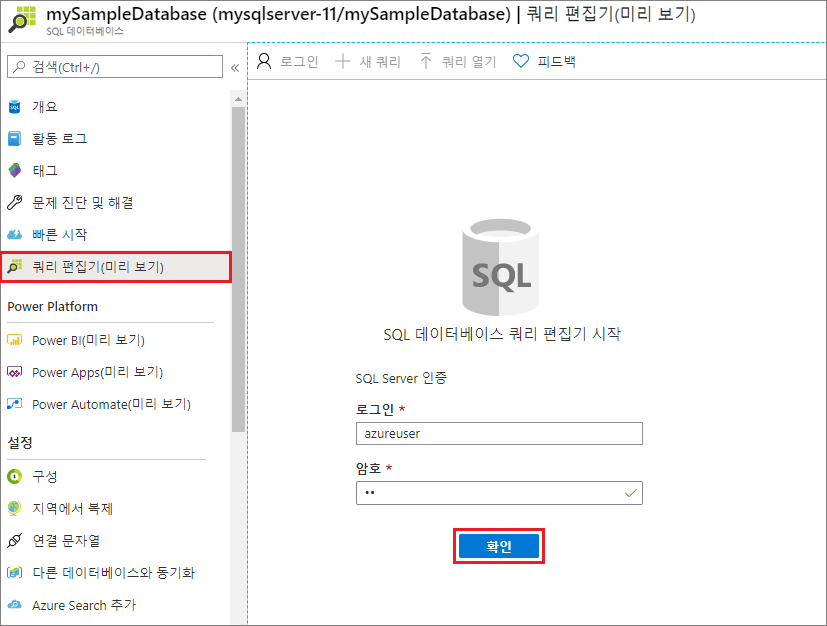
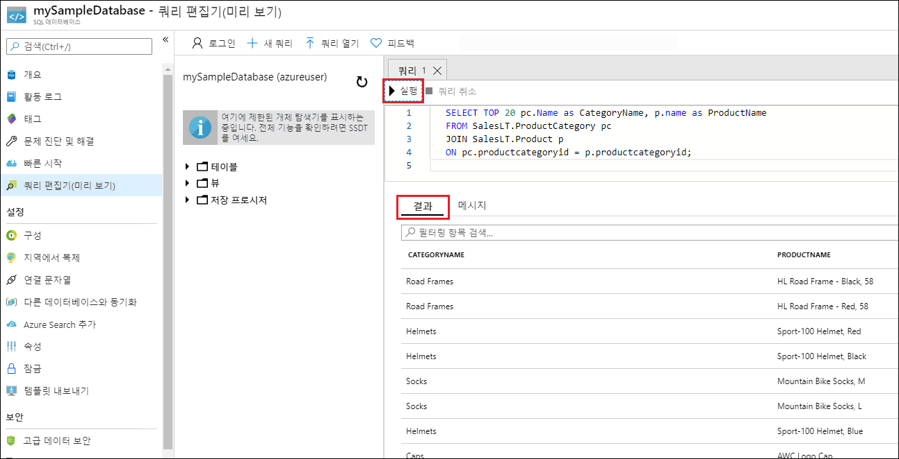

# 미니 랩: Azure SQL 데이터베이스의 단일 데이터베이스 만들기

이 미니 랩에서는 Azure Portal을 사용하여 Azure SQL 데이터베이스 단일 데이터베이스를 만듭니다. 그런 다음 Azure Portal에서 쿼리 편집기를 사용하여 데이터베이스를 쿼리합니다.

단일 데이터베이스는 Azure SQL 데이터베이스에 가장 빠르고 간단한 배포 옵션입니다. 지정된 Azure 지역의 Azure 리소스 그룹 내에 있는 SQL Database 서버 내에서 단일 데이터베이스를 관리할 수 있습니다. 이 미니 랩에서는 새 데이터베이스에 대한 새 리소스 그룹 및 SQL 서버를 만듭니다.

*프로비저닝* 또는 *서버리스* 컴퓨팅 계층에서 단일 데이터베이스를 만들 수 있습니다. 프로비전된 데이터베이스는 CPU 및 메모리를 포함한 고정된 양의 컴퓨팅 리소스를 미리 할당하고 두 개의 구매 모델 중 하나를 사용합니다. 이 미니 랩은 vCore 기반 구매 모델을 사용하여 프로비전된 데이터베이스를 만듭니다.

## 단일 데이터베이스 만들기

이 단계에서는 Azure SQL Database 서버와 AdventureWorksLT 샘플 데이터를 사용하는 단일 데이터베이스를 만듭니다. Azure Portal 메뉴 및 화면을 사용하거나 Azure Cloud Shell에서 Azure CLI 또는 PowerShell 스크립트를 사용하여 데이터베이스를 만들 수 있습니다.

Azure Portal에서 리소스 그룹, SQL 서버 및 단일 데이터베이스를 만들려면 다음을 수행합니다.

1. [https://portal.azure.com](https://portal.azure.com/)에서 Azure Portal에 로그인합니다.

2. 검색 창에서 **Azure SQL**를 검색하고 선택합니다.

3. Azure SQL 페이지에서 **추가**를 선택합니다.



4. **SQL 배포 옵션 선택** 페이지에서 **리소스** 유형 아래에 **단일 데이터베이스** 가 있는 **SQL 데이터베이스** 타일을 선택합니다. **세부 정보 표시**를 선택하여 다른 데이터베이스에 대한 자세한 정보를 볼 수 있습니다.

5. **만들기**를 선택합니다.



6. SQL 데이터베이스 만들기 양식의 **기본** 탭에서 **프로젝트 세부 정보**에서 아직 선택되지 않았으면 올바른 Azure 구독을 선택합니다.

7. **리소스 그룹** 아래에서 **새로 만들기**를 선택하고 *myResourceGroup*을 입력한 다음 **확인**을 선택합니다.

8. **데이터베이스 세부 정보** 아래에서 **데이터베이스 이름**에 mySampleDatabase를 입력합니다.

9. **서버**의 경우 **새 서버 만들기**를 선택하고 다음과 같이 새 서버 양식을 작성합니다.

- **서버 이름**: 고유성을 위해 *mysqlserver* 및 일부 문자를 입력합니다.

- **서버 관리자 로그인**: *azureuser*를 입력합니다.

- **비밀번호**: 요구 사항을 충족하는 비밀번호를 입력하고 **비밀번호 확인** 필드에 다시 입력합니다.

- **위치**: 드롭 다운에서 **(미국)미국 동부**와 같은 위치를 선택합니다.

**확인**을 선택합니다.



서버와 데이터베이스에 로그인할 수 있도록 서버 관리자 로그인 및 비밀번호를 적어두세요. 로그인이나 비밀번호를 잊어버리는 경우에는 데이터베이스가 만들어진 후 **SQL 서버** 페이지에서 비밀번호를 다시 설정하거나 로그인 이름을 확인할 수 있습니다. **SQL 서버** 페이지를 열려면 데이터베이스 **개요** 페이지에서 서버 이름을 선택합니다.

10. **컴퓨팅+ 스토리지** 아래에서 기본값을 다시 구성하려면 **데이터베이스 구성**을 선택합니다.

**구성** 페이지에서는 선택적으로 다음을 수행할 수 있습니다.

- **컴퓨팅 계층**을 **프로비전됨**에서 **서버리스**로 변경합니다.

- **vCore** 및 **데이터 최대 크기**에 대한 설정을 검토하고 변경합니다.

- 하드웨어 생성을 변경하려면 **변경 구성**을 선택합니다.

변경한 후 **적용**을 선택합니다.

11. 페이지 맨 아래에서 **다음: 네트워킹**을 선택합니다.



12. **네트워킹** 탭 **연결 방법** 아래에서 **공개 엔드포인트**를 선택합니다.

13. **방화벽 규칙** 아래 **현재 클라이언트 IP 주소 추가**를 **예**로 설정합니다.

14. 페이지 맨 아래에서 **다음: 추가** 설정을 선택합니다.




15. **추가 설정** 탭 **데이터 원본** 섹션에서 **기존 데이터 사용**을 위해 **샘플**을 선택합니다.

16. 페이지 맨 아래의 **검토 + 만들기**를 선택합니다.



17. 설정을 검토한 후 **만들기**를 선택합니다.

## 데이터베이스 쿼리

데이터베이스가 만들어지면 Azure Portal의 기본 제공 쿼리 편집기를 사용하여 데이터베이스에 연결하고 데이터를 쿼리할 수 있습니다.

1. Portal에서 **SQL databases**을 검색하여 선택한 다음 목록에서 데이터베이스를 선택합니다.

2. 데이터베이스의 **SQL 데이터베이스** 페이지 왼쪽 메뉴에서 **쿼리 편집기**를 선택합니다.

3. 서버 관리자 로그인 정보를 입력하고 **확인**을 선택합니다.



4. 코드 편집기 창에서 다음 쿼리를 입력합니다.

```SQL

SELECT TOP 20 pc.Name as CategoryName, p.name as ProductName

FROM SalesLT.ProductCategory pc

JOIN SalesLT.Product p

ON pc.productcategoryid = p.productcategoryid;
```

5. **실행**을 선택하고 **결과** 창에서 쿼리 결과를 검토합니다.



6. **쿼리 편집기** 페이지를 닫고 저장되지 않은 편집 내용을 삭제하라는 메시지가 표시되면 **확인**을 선택합니다.

 

 
