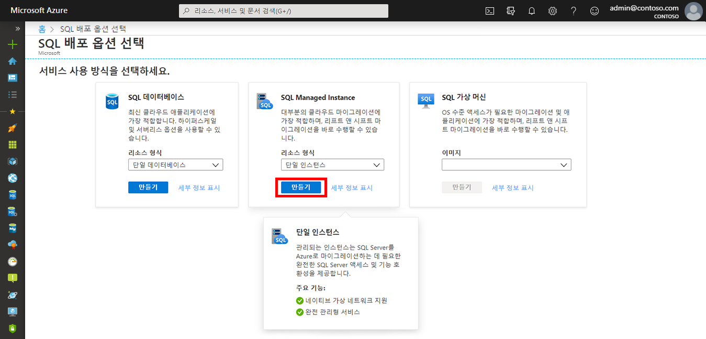
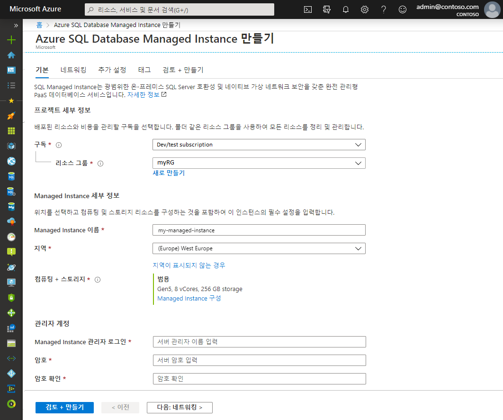
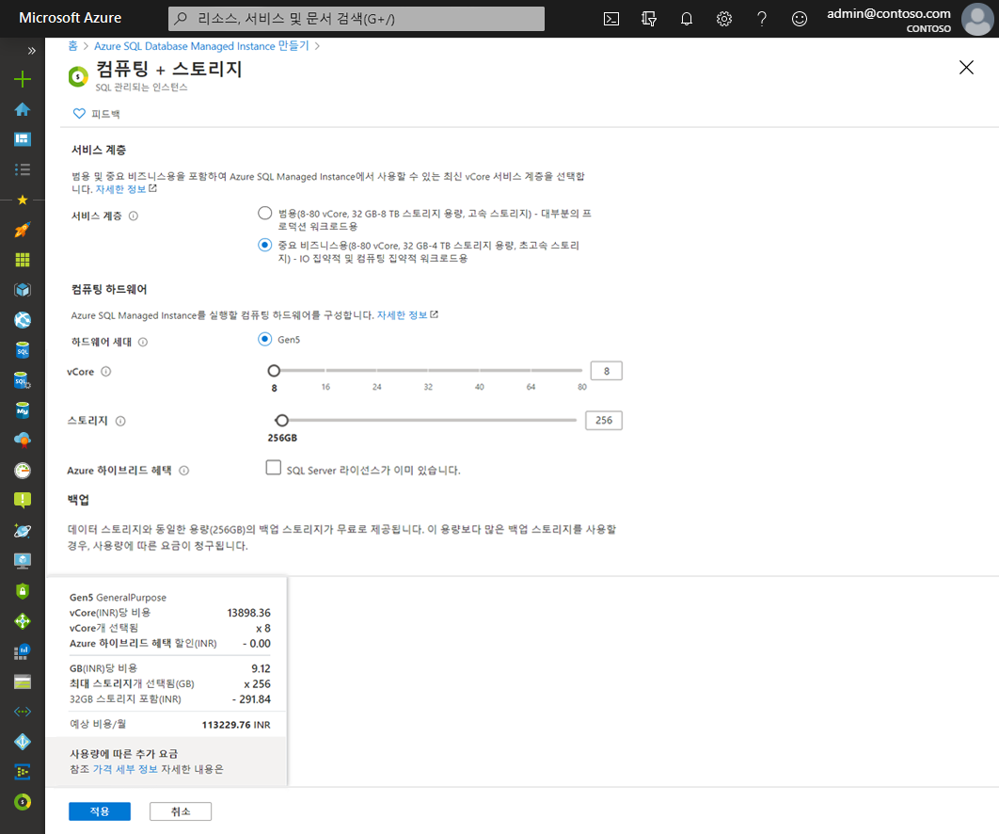
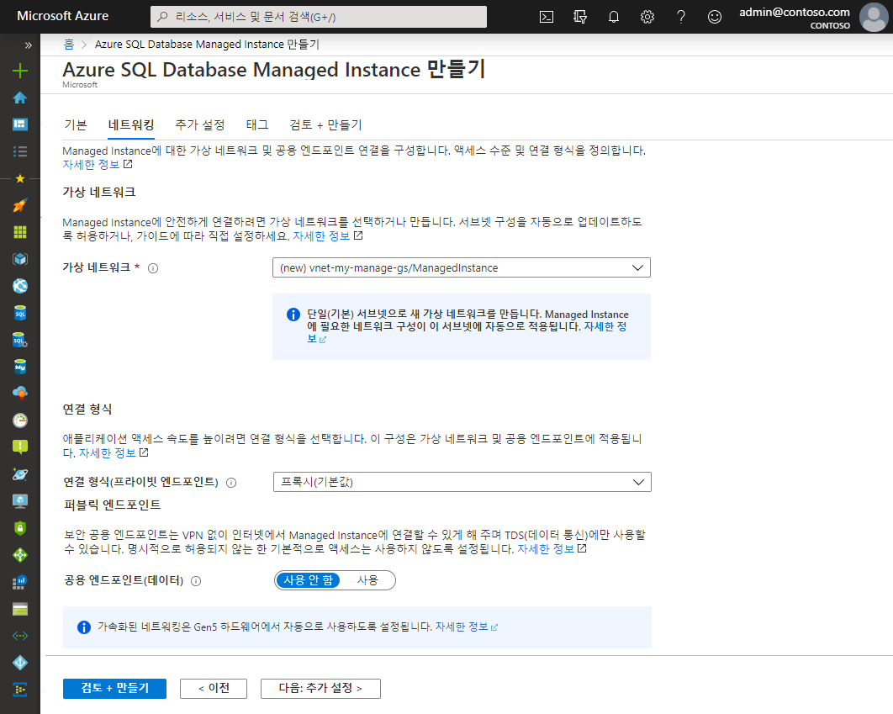
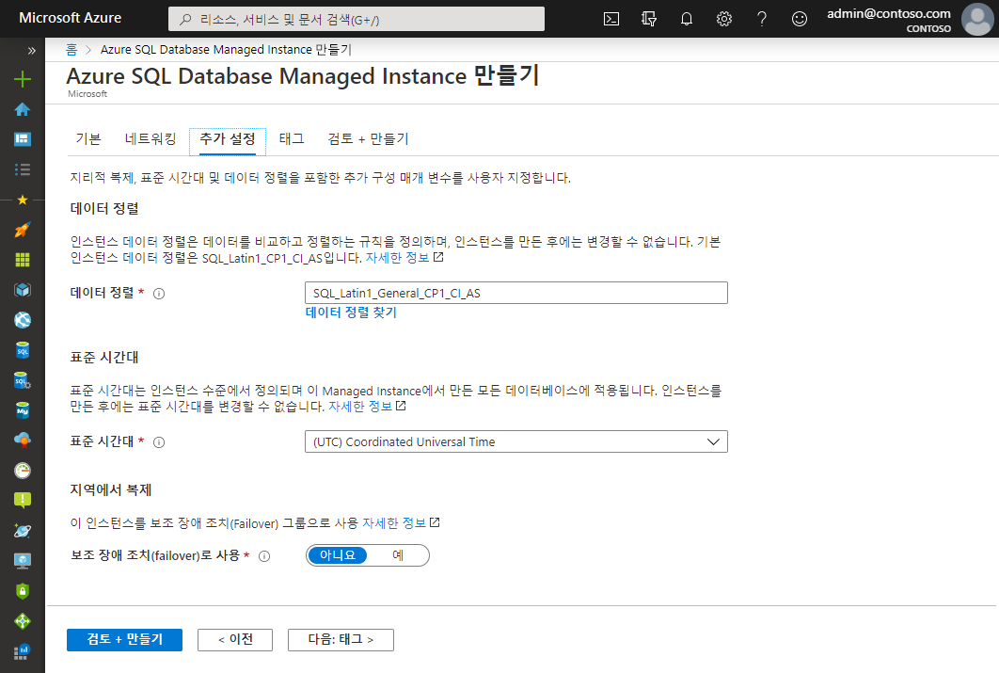
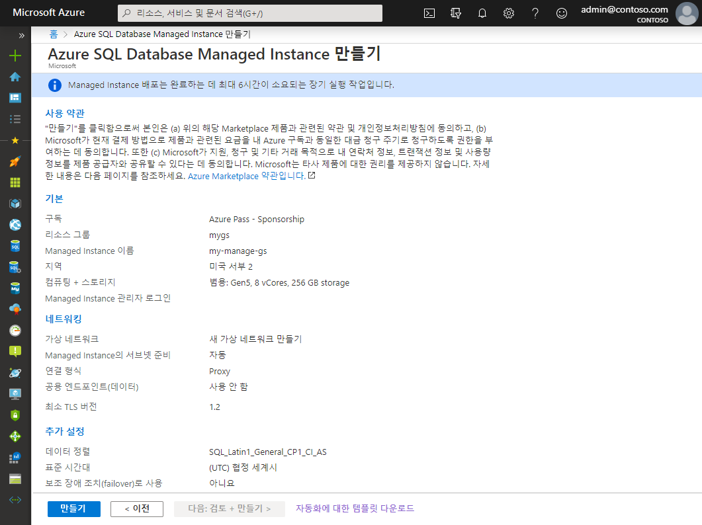

# 미니 랩: Azure SQL Database Managed Instance 만들기

이 미니 랩에서는 Azure Portal에서 Azure SQL Database 관리되는 인스턴스를 만드는 방법을 살펴봅니다.

[https://portal.azure.com](https://portal.azure.com/)에서 Azure Portal에 로그인합니다.

## 관리되는 인스턴스 만들기

다음 단계에서 관리되는 인스턴스 만드는 방법을 볼 수 있습니다.

1. Azure Portal의 왼쪽 메뉴에서 **Azure SQL**을 선택합니다. **Azure SQL**이 목록에 없는 경우 **모든 서비스**를 선택한 다음 검색 상자에 *Azure SQL*을 입력합니다.

2. **+추가**를 선택하여 **SQL 배포 옵션 선택** 페이지를 엽니다. **관리되는 인스턴스** 타일에서 **세부 정보 표시**를 선택하여 Azure SQL Database 관리되는 인스턴스에 대한 추가 정보를 볼 수 있습니다.

3. **만들기**를 선택합니다.

4. **Azure SQL Database Managed Instance 만들기** 프로비전 양식에서 탭을 사용하여 필수 및 선택적 정보를 추가합니다. 다음 섹션에서는 이러한 탭에 대해 설명합니다.

## 기초

* **기본** 탭에 필요한 필수 정보를 입력합니다.

이 탭에서 필요한 정보를 참조하려면 아래 표를 확인합니다.

| 설정 | 제안 값 | 설명  |
|---------------------------------------------------|---------------------------------------------------------------------------------|-------------------------------------------------------------------------------------------------------------------------------------------------------------------------------------------------------------------------------------------------------------------------------------------------------------------------------------------------------------------------------------------------------------------------------------------------------------------------------------------------------------------------------------------------------------------------------------------------------------------------------------------------------------------------------------------------------------|
| Virtual Network | 새 가상 네트워크 만들기를 선택하거나 유효한 가상 네트워크와 서브넷을 선택합니다. | 네트워크 또는 서브넷을 사용할 수 없는 경우에는 새 Managed Instance용 대상으로 선택하기 전에 네트워크 요구 사항을 충족하도록 수정해야 합니다. Managed Instance용 네트워크 환경 구성을 위한 요구 사항에 대한 자세한 내용은 Managed Instance용 가상 네트워크 구성을 참조하세요. |
| 연결 형식 | 프록시와 리디렉션 연결 형식 중에서 선택합니다. | 연결 유형에 대한 자세한 내용은 Azure SQL Database 연결 정책을 참고하세요. |
| 공용 엔드포인트 | 사용을 선택합니다. | 공용 데이터 엔드포인트를 통해 관리되는 인스턴스에 액세스하려면 이 옵션을 활성화해야 합니다. |
| 다음에서 액세스 허용(공용 엔드포인트가 활성화된 경우) | 옵션 중 하나를 선택합니다. | 포털 환경에서는 공용 엔드포인트를 사용하여 보안 그룹을 구성할 수 있습니다.    |

* 컴퓨팅 및 스토리지 리소스 크기를 지정하고 가격 책정 계층을 검토하려면 **Managed Instance 구성**을 선택합니다. 슬라이더나 텍스트 상자를 사용하여 스토리지 용량과 가상 코어 수를 지정합니다. 구성을 완료한 후 **적용**을 선택하여 선택 사항을 저장합니다.

* 관리되는 인스턴스를 만들기 전에 선택 사항을 검토하려면 **검토 +만들기**를 선택합니다. 또는 **다음: **을 선택하여 네트워킹 옵션을 구성합니다. **네트워킹**.

## 네트워킹

* **네트워킹**탭에서 선택적 정보를 입력합니다. 이 정보를 생략하면 포털에 기본 설정이 적용됩니다.

이 탭에서 필요한 정보를 참조하려면 아래 표를 확인합니다.

| 설정 | 제안 값 | 설명  |
|---------------------------------------------------|---------------------------------------------------------------------------------|------------------------------------------------------------------------------------------------------------------------------------------------------------------------------------------------------------------------------------------------------------------------------------------------------------------------------|
| 가상 네트워크 | 새 가상 네트워크 만들기를 선택하거나 유효한 가상 네트워크와 서브넷을 선택합니다. | 네트워크 또는 서브넷을 사용할 수 없는 경우에는 새 Managed Instance용 대상으로 선택하기 전에 네트워크 요구 사항을 충족하도록 수정해야 합니다. Managed Instance용 네트워크 환경 구성을 위한 요구 사항에 대한 자세한 내용은 Managed Instance용 가상 네트워크 구성을 참조하세요. |
| 연결 형식 | 프록시와 리디렉션 연결 형식 중에서 선택합니다. | 연결 유형에 대한 자세한 내용은 Azure SQL Database 연결 정책을 참고하세요. |
| 공용 엔드포인트 | 사용을 선택합니다. | 공용 데이터 엔드포인트를 통해 관리되는 인스턴스에 액세스하려면 이 옵션을 활성화해야 합니다. |
| 다음에서 액세스 허용(공용 엔드포인트가 활성화된 경우) | 옵션 중 하나를 선택합니다. | 포털 환경에서는 공용 엔드포인트를 사용하여 보안 그룹을 구성할 수 있습니다.    |

* 관리되는 인스턴스를 만들기 전에 선택 사항을 검토하려면 **검토 + 만들기**를 선택합니다. 또는 **다음**을 선택하여 더 많은 사용자 지정 설정을 구성합니다.** 추가 설정**.

## 추가 설정

* **추가 설정** 탭에서 선택적 정보를 입력합니다. 이 정보를 생략하면 포털에 기본 설정이 적용됩니다.

이 탭에서 필요한 정보를 참조하려면 아래 표를 확인합니다.

| 설정 | 제안 값 | 설명  |
|-----------------------------------------------------------------------|------------------------------------------------------------------------------------------------------------------------------------------------------------------------------------------------------------|-----------------------------------------------------------------------------------------------------------------------------------------------------------------------|
| 데이터 정렬 | Managed Instance에 사용할 데이터 정렬을 선택합니다. SQL Server에서 데이터베이스를 마이그레이션하는 경우 SELECT SERVERPROPERTY(N'Collation')를 사용하여 원본 데이터 정렬을 선택하고 해당 값을 사용합니다. | 데이터 정렬에 대한 자세한 내용은 서버 데이터 설정 또는 변경을 참조하세요. |
| 표준 시간대 | Managed Instance가 사용할 표준 시간대를 선택합니다. | 자세한 내용은 표준 시간대를 참조하세요. |
| 보조 장애 조치(failover)로 사용 | 예를 선택합니다. | 이 옵션을 통해 Managed Instance를 보조 장애 조치(failover) 그룹으로 사용할 수 있습니다. |
| 기본 Managed Instance(보조 장애 조치(failover)로 사용이 예로 설정된 경우) | 만들려 하는 Managed Instance와 동일한 DNS 영역에 가입할 기존 기본 Managed Instance를 선택합니다. | 이 단계는 장애 조치(failover) 그룹 생성 후 구성이 가능하도록 설정합니다.  |

## 검토 + 만들기

5. Managed Instance를 만들기 전에 **검토 + 만들기** 탭을 선택하여 선택 사항을 검토합니다.

6. **만들기**를 선택하여 Managed Instance를 프로비저닝하기 시작합니다.

 
