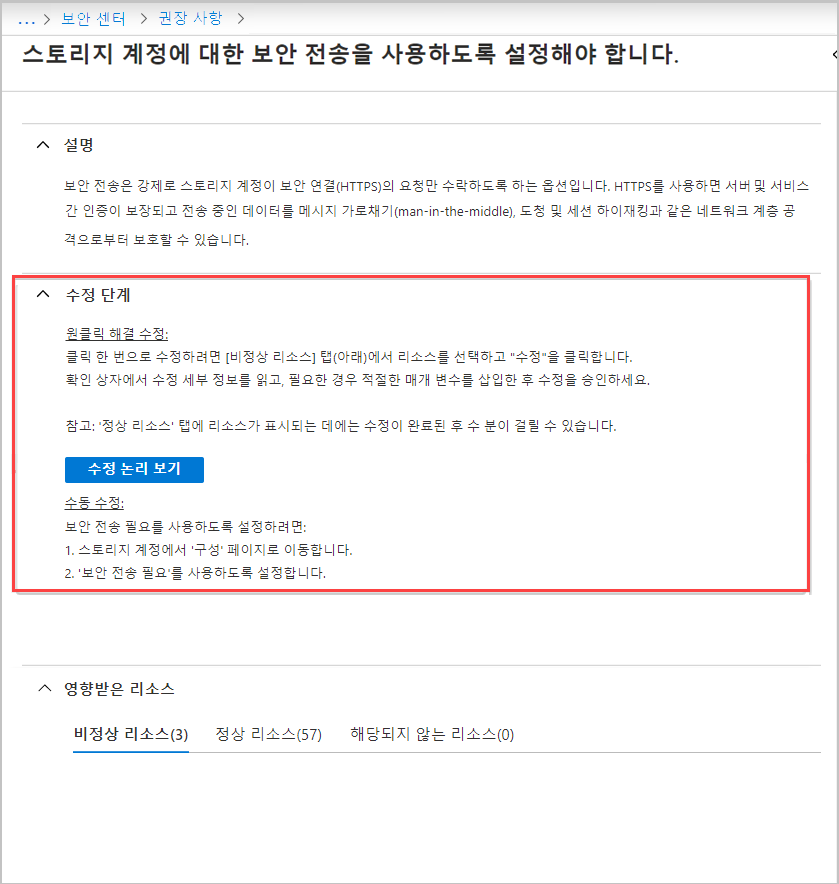
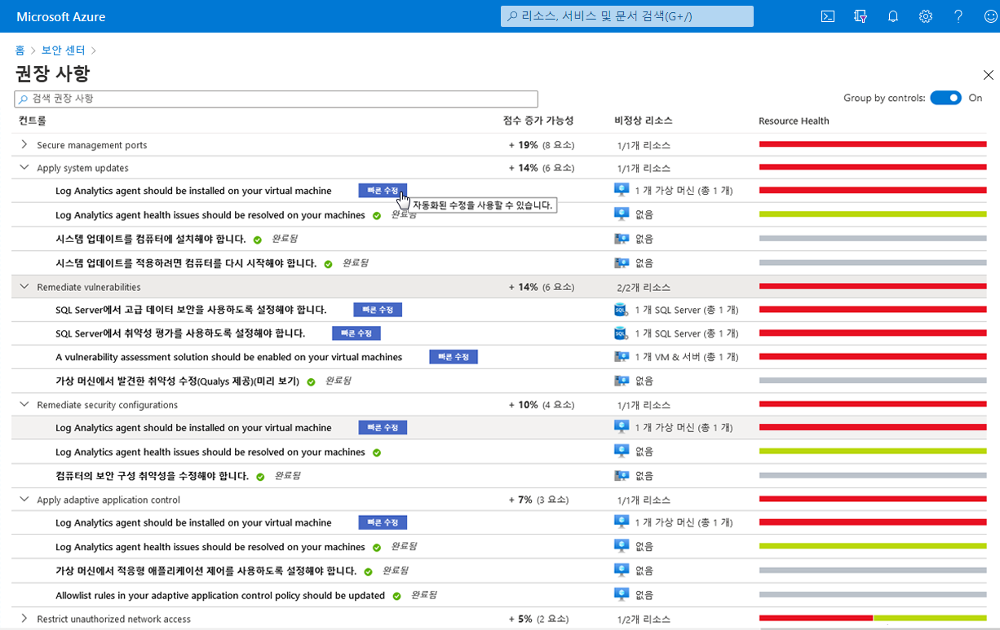

# 미니 랩: Azure 보안 센터

이 미니 랩의 경우 모니터링 에이전트가 활성화되지 **않은** 하나 이상의 Linux VM이 필요합니다.

## Azure Security Center로 이동

1. [https://portal.azure.com](https://portal.azure.com/)에서 Azure Portal에 로그인합니다.

1. **Security Center** > **권장 사항**으로 이동합니다.

## 권장 사항을 통해 소프트웨어 모니터링 추가

권장 사항에서는 리소스를 보다 잘 보호할 수 있는 방법에 대한 제안을 제공합니다. 권장 사항은 권장 사항에 제공된 수정 단계를 수행하여 구현됩니다.

1. 권장 사항을 클릭하여 수정 단계 섹션을 연 다음 해당 단계를 검토합니다. 각 권장 사항에는 고유한 지침 집합이 있습니다. 다음 스크린샷에는 HTTPS를 통해 트래픽만 허용하도록 애플리케이션을 구성하기 위한 수정 단계가 표시됩니다.

    

1. 권장 사항 목록으로 돌아갑니다. 일부 권장 사항에는 **빠른 수정!** 레이블이 있습니다. 빠른 수정을 사용하면 여러 리소스에 대한 권장 사항을 신속하게 수정할 수 있습니다. 특정 권장 사항에 대해서만 사용할 수 있습니다. 빠른 수정은 수정을 단순화하고 보안 점수를 빠르게 올려 사용자 환경의 보안을 개선할 수 있습니다.

1. **가상 머신에 모니터링 에이전트 설치** 권장 사항 옆에 있는 **보안 구성 수정** 목록에서 **빠른 수정!** 을 클릭합니다.

    

1. **비정상 리소스** 탭에서 권장 사항을 구현할 리소스를 선택한 다음 **수정**을 클릭합니다.

    >:heavy_check_mark: **참고:** 나열된 리소스 중 일부는 수정할 수 있는 적절한 권한이 없기 때문에 비활성화될 수 있습니다.

1. 확인란에서 수정 세부 정보 및 영향에 대해 읽어보십시오.

    >:heavy_check_mark: **참고:** 영향은 **수정**을 클릭한 후 열리는 **수정 리소스** 창의 회색 상자에 나열됩니다. 빠른 수정을 진행할 때 어떤 변화가 발생하는지 나열합니다.

1. 필요한 경우 관련 매개 변수를 삽입한 다음 수정을 승인합니다.

    >:heavy_check_mark: **참고:** 수정이 완료된 후 몇 분 정도 걸릴 수 있으므로 **정상 리소스** 탭에서 리소스를 확인할 수 있습니다. 수정 작업을 보려면 활동 로그를 확인합니다.

1. 완료되면 수정되었는지 알려주는 알림이 표시됩니다.
