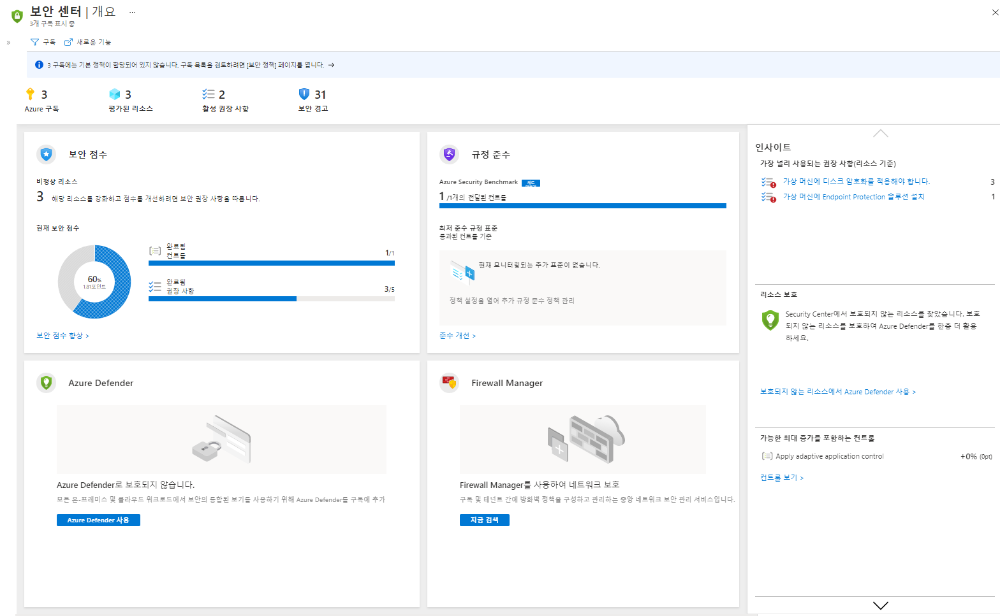

# 미니 랩: Azure Security Center

Azure Security Center에서는 하이브리드 클라우드 워크로드 전반에 적용되는 통합 보안을 관리 및 위협 방지 기능을 제공합니다. Azure 구독에서 Security Center를 활성화하려면 다음 단계를 수행합니다.

1. [Azure Portal](https://portal.azure.com)에 로그인합니다.

1. Portal의 메뉴에서 **Security Center**를 선택합니다. 

    Security Center 개요 페이지가 열립니다.

    

**Security Center – 개요**에서는 하이브리드 클라우드 워크로드의 보안 태세를 총체적으로 확인하여 워크로드의 보안을 검색 및 평가하고 위험을 파악 및 완화할 수 있습니다. Security Center는 이전에 사용자 또는 다른 구독 사용자가 온보딩하지 않은 Azure 구독을 자동으로 사용하도록 설정합니다(비용 없음).

Security Center를 처음 시작하면 수분 내에 다음이 표시될 수 있습니다.

- 연결된 리소스의 보안을 개선하는 방법에 대한 인사이트 권장 사항.
- 문제를 신속하게 조사하고 공격을 해결하는 데 필요한 정보와 함께 우선 순위가 지정된 보안 경고 목록
- 현재 Security Center에서 평가 중인 리소스 인벤토리 및 각 리소스의 보안 태세입니다.
- 구독의 보안 태세에 대한 보안 점수 측정값

> **팁:** 관리 그룹 내의 모든 구독에서 Security Center를 사용하도록 설정하려면 [여러 Azure 구독에서 Security Center 사용](https://docs.microsoft.com/ko-kr/azure/security-center/onboard-management-group)을 참조하세요.
