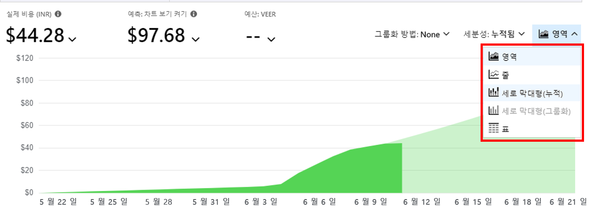
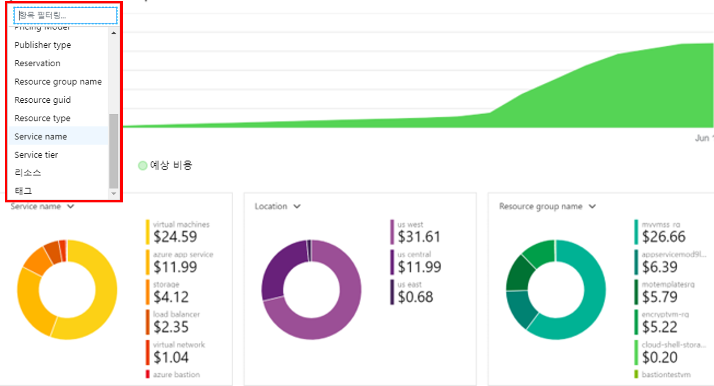

# 미니 랩: Azure Monitor로 비용 모니터링

이 미니 랩에서는 청구 기간 동안 이전에 실행되고 현재도 실행 중인 서비스가 있어야 합니다. 리소스가 배포된 후 24시간 미만인 경우 데이터를 사용할 수 없습니다.

## 비용 분석으로 이동

1. [https://portal.azure.com](https://portal.azure.com/)에서 Azure Portal에 로그인합니다.

1. **비용 관리**를 검색하고 결과 목록에서 **비용 관리 + 청구**를 선택합니다.

1. **비용 관리**에서 **비용 분석**을 선택하고 검토합니다. 
> **비용 관리 + 청구 개요**와 유사합니다.

## 사용자 지정 보고서

1. 디스플레이를 사용자 지정하여 실제 및 예상 비용을 표시합니다. 세분성을 변경하고 **영역**을 선택하여 차트 유형을 변경합니다.

    
    
1. 추가 차트(예: **서비스 이름**, **위치** 및 **리소스 그룹 이름**)의 경우 이러한 차트에서 필터를 사용하여 다른 데이터에 대한 결과를 표시합니다.

    
