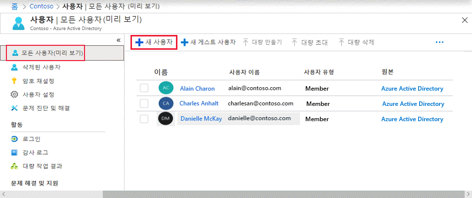

# 미니 랩: Azure Active Directory를 사용하여 사용자 추가

Azure AD(Azure Active Directory) 조직에서 새 사용자를 추가하거나 기존 사용자를 삭제합니다. 사용자를 추가하거나 삭제하려면 사용자 관리자 또는 전역 관리자여야 합니다.

Azure Active Directory 포털을 사용하여 새 사용자를 만들 수 있습니다. 다음 단계를 수행합니다.

1.	조직의 사용자 관리자로 Azure Portal([https://portal.azure.com](https://portal.azure.com/))에 로그인합니다.

2.	모든 페이지에서 *Azure Active Directory*를 검색하고 선택합니다.

3.	**사용자**, **새 사용자**를 차례로 선택합니다.

    

4.	**사용자** 페이지에서 이 사용자에 대한 정보를 입력합니다.

    - **이름**. 필수 항목. 새 사용자의 이름과 성입니다. 예를 들어 *TesterAAD*입니다.

    - **사용자 이름**. 필수 항목. 새 사용자의 사용자 이름입니다. 예를 들어 *TesterAAD@contoso.com*입니다. 사용자 이름의 도메인 부분은 *<yourdomainname>.onmicrosoft.com*과 같은 초기 기본 도메인 이름 또는 *contoso.com*과 같은 사용자 지정 도메인 이름을 사용해야 합니다.

    - **작업 정보**: 여기에서 사용자에 대한 자세한 정보를 추가하거나 나중에 추가할 수 있습니다. 사용자 정보 추가에 대한 자세한 내용은 [사용자 프로필 정보를 추가하거나 변경하는 방법](https://docs.microsoft.com/ko-kr/azure/active-directory/fundamentals/active-directory-users-profile-azure-portal)을 참조하십시오.

5.	**암호** 상자에 제공되는 자동 생성 암호를 복사합니다. 처음으로 로그인하려는 사용자에게 이 암호를 제공해야 합니다.

6.	**만들기**를 선택합니다.

사용자가 생성되어 Azure AD 조직에 추가됩니다.
