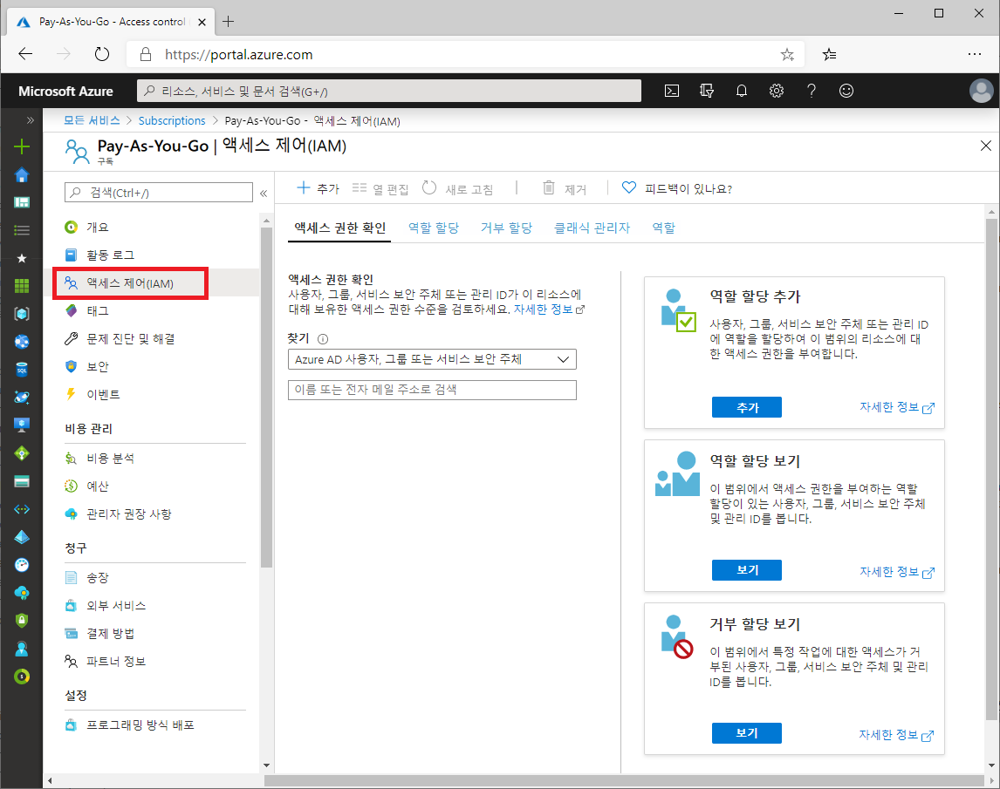
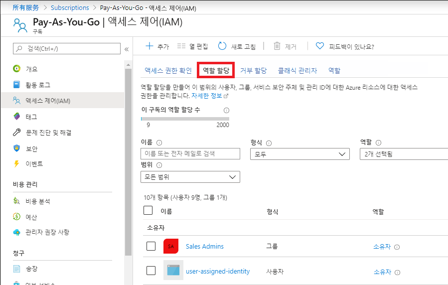
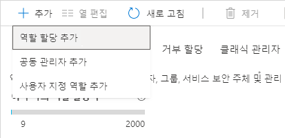
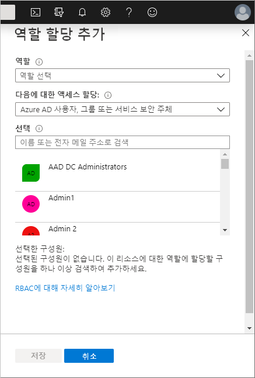
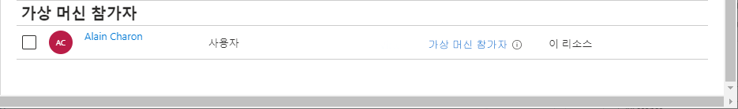

# 미니 랩: Azure 역할 할당 추가 

## 사전 요구 사항

역할 할당을 추가하거나 제거하려면 다음이 있어야 합니다.

* ```Microsoft.Authorization/roleAssignments/write``` 및 ```Microsoft.Authorization/roleAssignments/delete``` 권한(예: U*ser Access Administrator* 또는 *Owner*).


**액세스 제어(IAM)** 는 Azure 리소스에 대한 액세스 권한을 부여하기 위해 역할을 할당할 때 사용하는 블레이드입니다. ID 및 액세스 관리라고도 하며 Azure Portal의 여러 위치에서 나타납니다. 다음 스크린샷은 구독에 대한 IAM(액세스 제어) 블레이드의 예를 보여 줍니다.



IAM(액세스 제어) 블레이드를 가장 효과적으로 사용하려면 역할을 할당할 때 다음 세 가지 질문에 답할 수 있으면 더욱 좋습니다.

**1. 액세스가 필요한 사람은 누구입니까?**

예: 사용자, 그룹, 서비스 주체, 관리 ID. 이를 *보안 주체*라고도 합니다.

**2. 그들은 어떤 역할이 필요합니까?**

권한은 역할로 함께 그룹화됩니다. 여러 기본 제공 역할 리스트 중에서 선택하거나 사용자 지정 역할을 사용할 수 있습니다.

**3. 어디에서 액세스해야 합니까?**

액세스 권한이 적용되는 리소스 집합을 나타냅니다. 관리 그룹, 구독, 리소스 그룹 또는 스토리지 계정과 같은 단일 리소스가 될 수도 있습니다. 이를 *범위*라고 합니다.

## 역할 할당 추가

Azure RBAC에서 Azure 리소스에 액세스 권한을 부여하려면 역할 할당을 추가합니다. 다음 단계를 수행하여 역할을 할당합니다.

1. Azure Portal에서 **모든 서비스**를 클릭한 다음 액세스 권한을 부여할 범위를 선택합니다. 

2. 해당 범위의 특정 리소스를 클릭합니다.

3. **액세스 제어(IAM)** 를 클릭합니다.

4. **역할 할당** 탭을 클릭하여 이 범위의 역할 할당을 봅니다.



5. **추가** > **역할 할당 추가**를 클릭합니다.

역할을 할당할 권한이 없으면 **역할 할당 추가** 옵션을 사용할 수 없게 됩니다.



**역할 할당 추가** 창이 열립니다.



6. **역할** 드롭다운 목록에서 **가상 머신 참가자**와 같은 역할을 선택합니다.

7. **선택** 목록에서 사용자, 그룹, 서비스 주체 또는 관리 ID를 선택합니다. 목록에 보안 주체가 표시되지 않으면 **Select** 상자에 입력하여 디렉터리에서 표시 이름, 전자 메일 주소, 개체 식별자를 검색할 수 있습니다.

8. **저장**을 클릭하여 역할을 할당합니다.

잠시 후 보안 주체는 선택한 범위에서 역할을 할당 받습니다.



 
