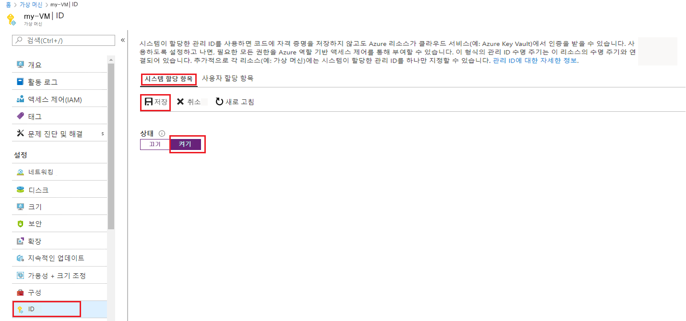

# 미니 랩: 기존 VM에서 시스템이 할당한 관리 ID 사용

## 관리 ID 사용

원래 시스템이 할당한 관리 ID 없이 프로비저닝된 VM에서 해당 ID를 사용하도록 설정하려면 계정에 [가상 머신 Contributor](https://docs.microsoft.com/ko-kr/azure/role-based-access-control/built-in-roles#virtual-machine-contributor) 역할 할당이 필요합니다. 추가 Azure AD 디렉터리 역할은 할당하지 않아도 됩니다.

1. VM이 포함된 Azure 구독과 연결된 계정을 사용하여 [https://portal.azure.com](https://portal.azure.com/)에서 Azure Portal에 로그인합니다.

2. 원하는 가상 머신으로 이동하여 **ID**를 선택합니다.

3. **시스템 할당** 아래의 **상태**에서 **켜기**를 선택한 다음 **저장**을 클릭합니다.

     

## 관리 ID(PowerShell)를 사용하여 Azure VM에 로그인

일반적으로 자체 ID로 보안 리소스에 액세스하려면 스크립트 클라이언트가 다음을 수행해야 합니다.

- 기밀/웹 클라이언트 응용 프로그램으로 Azure AD에 등록 및 동의합니다.

- 앱의 자격 증명(스크립트에 포함될 가능성이 있음)을 사용하여 서비스 주체로 로그인합니다.

Azure 리소스에 대한 관리 ID를 사용하면 Azure 리소스 서비스 주체에 대한 관리 ID 아래에서 로그인할 수 있으므로 스크립트 클라이언트는 더 이상 수행할 필요가 없습니다.

다음 스크립트는 다음 방법을 보여 줍니다:

1. Azure 리소스 서비스 주체에 대한 VM의 관리 ID 아래에서 Azure AD에 로그인합니다.  

2. Azure Resource Manager cmdlet를 호출하여 VM에 대한 정보를 가져옵니다. PowerShell은 토큰 사용을 자동으로 관리합니다.  

   ```azurepowershell
   Add-AzAccount -identity

   # Call Azure Resource Manager to get the service principal ID for the VM's managed identity for Azure resources. 
   $vmInfoPs = Get-AzVM -ResourceGroupName <RESOURCE-GROUP> -Name <VM-NAME>
   $spID = $vmInfoPs.Identity.PrincipalId
   echo "The managed identity for Azure resources service principal ID is $spID"
   ```
