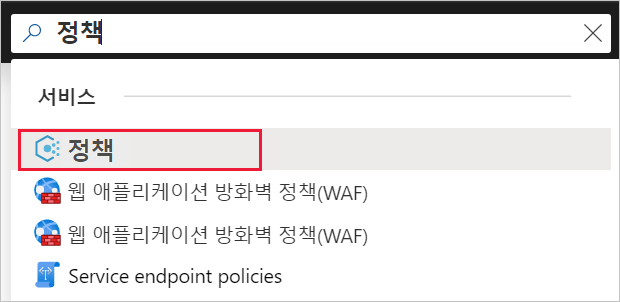
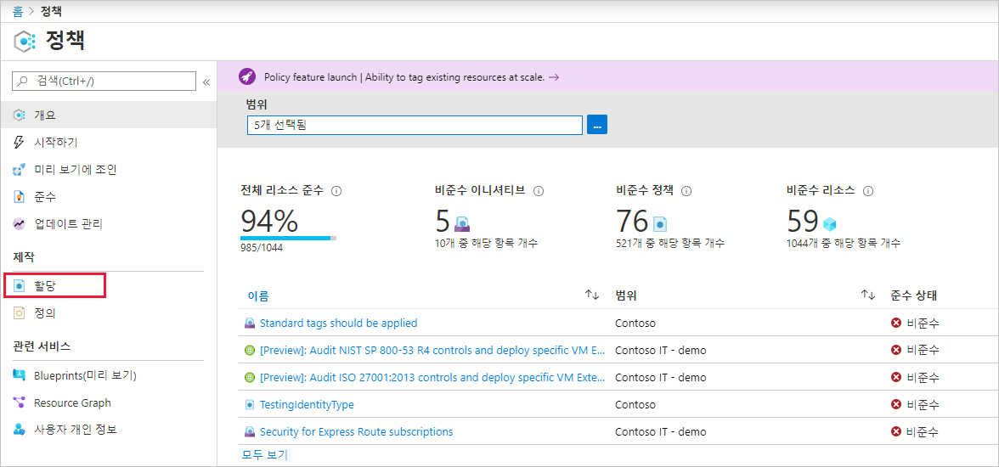
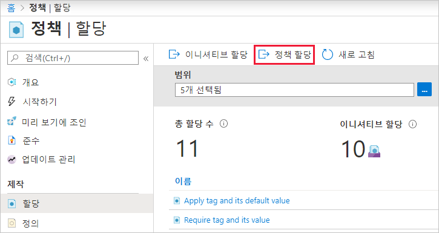
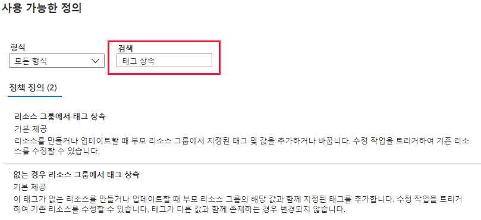

# 미니 랩: 규정 준수 시행을 위한 정책 생성 및 관리

이 미니 랩에서는 Azure Policy를 사용하여 다음과 같이 조직 전체에서 정책 만들기, 할당 및 관리와 관련된 몇 가지 일반적인 작업을 수행하는 방법을 배웁니다.

* 나중에 만들 리소스에 대한 조건을 적용하는 정책 할당

* 여러 리소스의 규정 준수 여부 추적을 위해 이니셔티브 정의 만들기/할당

* 비준수 또는 거부된 리소스 확인

* 조직 전체에서 새 정책 구현

## 정책 할당

Azure Policy를 통해 규정을 준수하는 첫 단계에서는 정책 정의를 할당합니다. 정책 정의는 정책이 적용되는 조건과 정책을 통해 적용하려는 효과를 정의합니다. 이 예제에서는 *누락된 경우 리소스 그룹에서 태그 상속*이라는 기본 제공 정책 정의를 할당하여 상위 리소스 그룹에서 해당 값이 있는 지정된 태그를 태그가 누락된 새로운 또는 업데이트된 리소스에 추가합니다.

1. Azure Portal로 이동하여 정책을 할당합니다. **정책**을 검색하고 선택합니다.

2. Azure Policy 페이지의 왼쪽에서 **할당**을 선택합니다. 할당은 특정 범위 내에서 수행할 정책을 할당하는 것입니다.

3. **정책 - 할당** 페이지 상단에서 **정책 할당**을 선택합니다.

4. **정책 할당** 페이지 및 **기본** 탭에서 줄임표를 선택하고 관리 그룹이나 구독을 선택하여 **범위**를 선택합니다. 필요한 경우 리소스 그룹을 선택합니다. 범위는 정책 할당이 적용되는 리소스 또는 리소스 그룹화를 결정합니다. 그런 다음, **범위** 페이지 아래쪽에서 **선택**을 선택합니다.

5. 범위를 기준으로 리소스를 제외할 수 있습니다. 제외는 **범위** 수준보다 하나 낮은 수준부터 시작됩니다. **제외**는 선택 사항이므로 일단은 비워 두세요.

6. **정책 정의** 줄임표를 선택하여 사용 가능한 정의 목록을 엽니다. 정책 정의 **유형**을 *기본 제공*으로 필터링하여 모두 확인하고 해당 설명을 읽을 수 있습니다.

7. **누락된 경우 리소스 그룹에서 태그 상속**을 선택합니다. 정책 정의를 찾아서 선택한 후 **사용 가능한 정의** 페이지 아래쪽에서 **선택**을 선택합니다.

8. **할당 이름**에는 선택한 정책 이름이 자동으로 입력됩니다. 하지만 이 이름은 변경할 수 있습니다. 이 예제에서는 *누락된 경우 리소스 그룹에서 태그 상속*을 그대로 둡니다. 원하는 경우 **설명**을 추가할 수도 있습니다. 설명은 이 정책 할당 관련 세부 정보를 제공합니다.

9. **정책 적용**을 *사용함*으로 둡니다. *사용 안 함*인 경우 이 설정을 사용하면 효과를 트리거하지 않고 정책의 결과를 테스트할 수 있습니다. 

10. **할당한 사람**은 로그인한 사람에 따라 자동으로 채워집니다. 

11. 마법사 위쪽의 **매개 변수** 탭을 선택합니다.

12. **태그 이름**에 *환경*을 입력합니다.

13. 마법사 위쪽의 **수정** 탭을 선택합니다.

14. **수정 작업 만들기**를 선택하지 않은 상태로 내버려 둡니다. 이 상자를 사용하면 새 리소스 또는 업데이트된 리소스 외에 기존 리소스를 변경하는 작업을 만들 수 있습니다. 

15. **관리 ID 만들기**는 이 정책 정의가 수정 효과를 사용하기 때문에 자동으로 선택됩니다. **사용 권한**은 정책 정의에 따라 자동으로 *Contributor*로 설정됩니다. 

16. 마법사 위쪽의 **검토 + 만들기** 탭을 선택합니다.

17. 해당 선택을 검토한 다음, 페이지 아래쪽의 **만들기**를 선택합니다.
