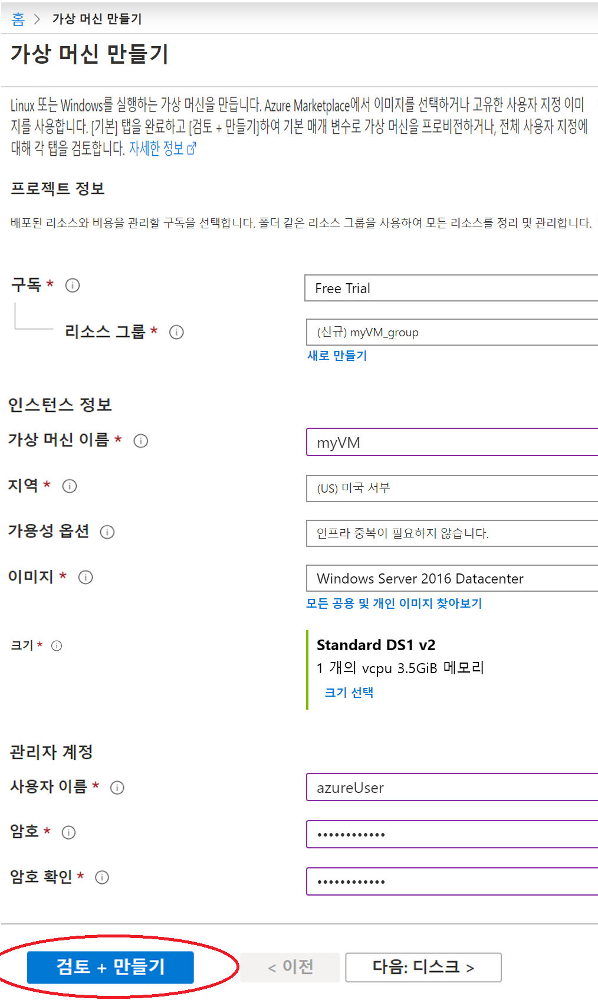
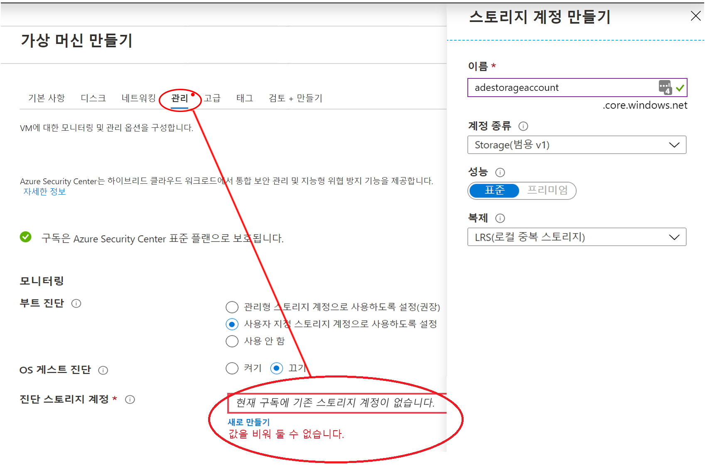
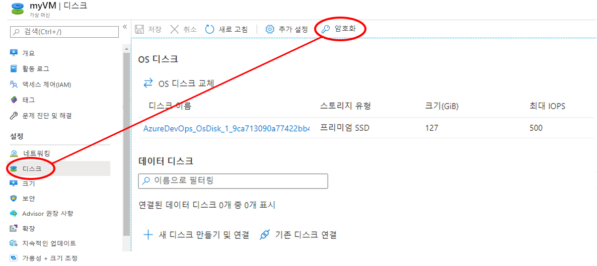
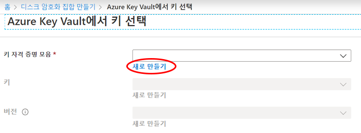
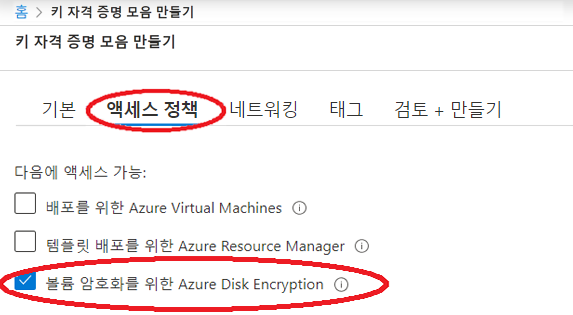

# 미니 랩: Azure Portal에서 Windows 가상 머신 만들기 및 암호화

Azure Portal을 통해 Azure VM(Virtual Machines)을 만들 수 있습니다. Azure Portal은 VM 및 관련 리소스를 만드는 브라우저 기반 사용자 인터페이스입니다. 이 미니 랩에서는 Azure Portal을 사용하여 Ubuntu 18.04 LTS를 실행하는 Windows VM(가상 머신)을 배포하고 암호화 키 저장을 위한 키 자격 증명 모음을 만들며 VM을 암호화합니다.

Azure 구독이 없는 경우 시작하기 전에 [free account](https://azure.microsoft.com/free/?WT.mc_id=A261C142F)를 만드세요.

## 가상 머신 만들기

1. [https://portal.azure.com](https://portal.azure.com/)에서 Azure Portal에 로그인합니다.
1. Azure Portal 왼쪽 위의 **리소스 만들기**를 선택합니다.
1. 새 페이지의 인기에서 **Windows Server 2016 Datacenter**를 선택합니다.
1. **기본 사항** 탭의 **프로젝트 세부 정보**에서 올바른 구독을 선택했는지 확인한 다음 **새 리소스 그룹 만들기**를 선택합니다. 이름으로 *myResourceGroup*을 입력합니다.
1. **가상 머신 이름**에 *MyVM*을 입력합니다.
1. **지역**의 경우 해당 지역을 선택합니다(예: *미국 동부*).
1. **크기**가 *표준 D2s v3*인지 확인합니다.
1. **관리자 계정**에서 **암호**를 선택합니다. 사용자 이름 및 암호를 입력합니다.

    
    
    >:경고: **경고.** **디스크** 탭에는 **디스크 옵션** 아래에 **암호화 유형** 필드가 있습니다. 이 필드는 Azure Disk Encryption이 아니라 관리디스크 + CMK에 대한 암호화 옵션을 지정하는 데 사용됩니다. 혼란을 방지하기 위해 이 자습서를 완료하는 동안 **디스크** 탭을 완전히 건너뛰는 것이 좋습니다.

1. **관리** 탭을 선택하고 진단 스토리지 계정이 있는지 확인합니다. 스토리지 계정이 없는 경우 **새로 만들기**를 선택하고 새 계정에 이름을 지정한 후 **확인**을 선택합니다.

    

1. **검토 + 만들기**를 선택합니다.
1. **가상 머신 만들기** 페이지에서 만들려는 VM 관련 세부 정보를 확인할 수 있습니다. VM을 만들 준비가 되면 **만들기**를 선택합니다.

VM을 배포하려면 몇 분 정도 걸립니다. 배포가 완료되면 다음 섹션으로 진행하세요.

## 가상 머신 암호화

>:경고: **경고.** 암호화 암호가 지역 경계를 넘지 않도록 하기 위해, Azure Disk Encryption에서는 Key Vault와 VM이 동일한 지역에 공동 배치되어야 합니다. 암호화할 VM과 동일한 영역에 있는 Key Vault를 만들고 사용합니다.

1. VM 배포가 완료되면 **리소스로 이동**을 선택합니다.
1. 왼쪽 사이드 바에서 **디스크**를 선택합니다.
1. 디스크 화면에서 **암호화**를 선택합니다. 

    

1. 암호화 화면의 **암호화할 디스크**에서 **OS 및 데이터 디스크**를 선택합니다.
1. **암호화 설정**에서 **암호화용 키 자격 증명 모음 및 키 선택**을 선택합니다.
1. **Azure Key Vault에서 키 선택** 화면에서 **새로 만들기**를 선택합니다.

    

1. **키 자격 증명 모음 만들기** 화면에서 리소스 그룹이 VM을 만드는 데 사용한 그룹과 동일한지 확인합니다.
1. 키 자격 증명 모음에 이름을 지정합니다. Azure의 모든 키 자격 증명 모음에는 고유한 이름이 있어야 합니다.
1. **액세스 정책** 탭에서 **볼륨 암호화용 Azure Disk Encryption** 상자를 선택합니다.

    

1. **검토 + 만들기**를 선택합니다.  
1. 키 자격 증명 모음이 유효성 검사를 통과한 후 **만들기**를 선택합니다. 그러면 **Azure Key Vault에서 키 선택** 화면으로 돌아갑니다.
1. **키** 필드를 비워 두고 **선택**을 선택합니다.
1. 암호화 화면 상단의 **저장**을 선택합니다. VM이 재부팅될 것임을 알려주는 팝업이 표시되면 **예**를 선택합니다.

## 리소스 정리

더 이상 필요하지 않은 경우 리소스 그룹, 가상 시스템 및 모든 관련 리소스를 삭제할 수 있습니다. 이렇게 하려면 가상 시스템의 리소스 그룹을 선택하고 **삭제**를 선택한다음 삭제할 리소스 그룹의 이름을 확인합니다.
